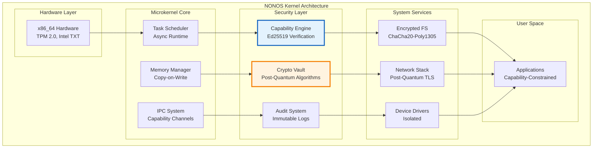
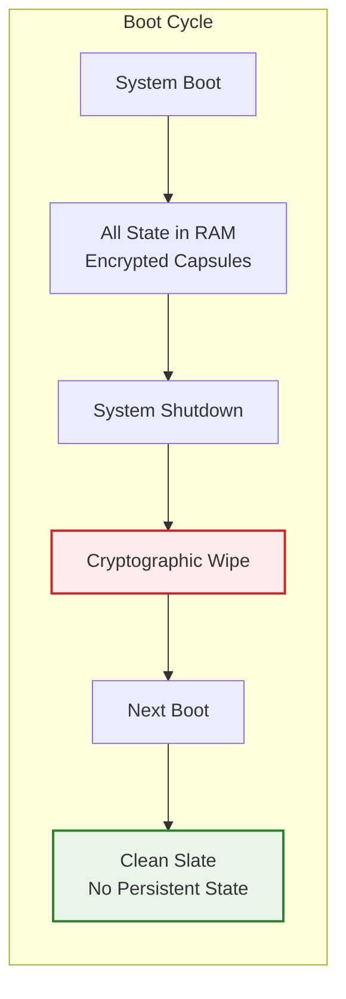
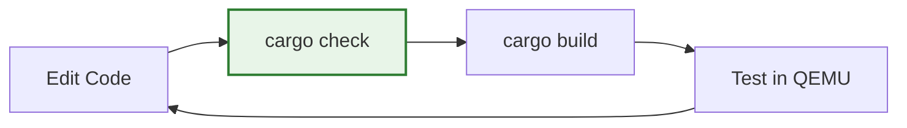
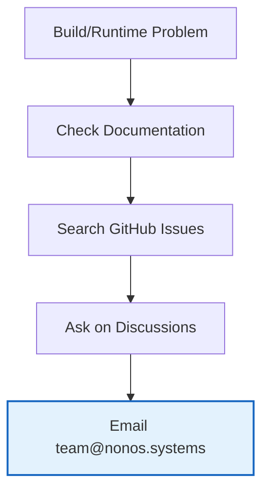

# NONOS Kernel

**A capability-based microkernel with post-quantum cryptography and zero-state architecture**

[](https://rustlang.org)
[](https://www.gnu.org/licenses/agpl-3.0)
[](https://github.com/nonos-kernel/nonos-kernel)

**Website**: [nonos.systems](https://nonos.systems) • **Contact**: [team@nonos.systems](mailto:team@nonos.systems)

---

## What is NONOS?

NONOS is a research microkernel designed around three core principles:

1. **Capability-based security** - Instead of users/groups, everything uses cryptographically-signed capability tokens
2. **Post-quantum cryptography** - Built-in support for quantum-resistant algorithms (Kyber, Dilithium, Ed25519)
3. **Zero-state architecture** - No persistent state survives reboots; everything is ephemeral and memory-resident

Think of it as: "What if we designed an OS from scratch knowing that quantum computers and nation-state attackers exist?"

### Key Features

- **Memory-safe** - Written in Rust, eliminates entire classes of vulnerabilities
- **Microkernel design** - Minimal kernel, everything else runs in user space
- **Real cryptographic security** - Every operation requires a valid capability token
- **Post-quantum ready** - Quantum-resistant cryptography built-in
- **Research platform** - Designed for security research and formal verification

---

## Quick Start

### Prerequisites

You'll need Rust nightly and some system tools:

```bash
# Install Rust nightly
curl --proto '=https' --tlsv1.2 -sSf https://sh.rustup.rs | sh
rustup install nightly
rustup default nightly

# Add bare metal target
rustup target add x86_64-unknown-none --toolchain nightly
```

**System packages:**

<details>
<summary><strong>Ubuntu/Debian</strong></summary>

```bash
sudo apt update
sudo apt install build-essential nasm qemu-system-x86 grub-pc-bin xorriso mtools
```
</details>

<details>
<summary><strong>Arch Linux</strong></summary>

```bash
sudo pacman -S base-devel nasm qemu grub xorriso mtools
```
</details>

<details>
<summary><strong>macOS</strong></summary>

```bash
brew install nasm qemu grub xorriso mtools
```
</details>

### Building

```bash
# Clone and build
git clone https://github.com/nonos-kernel/nonos-kernel.git
cd nonos-kernel

# Quick check (fast)
cargo check --target x86_64-nonos.json

# Debug build
cargo build --target x86_64-nonos.json

# Release build
cargo build --target x86_64-nonos.json --release
```

### Testing in QEMU

```bash
# Create bootable ISO
make iso

# Run in QEMU
qemu-system-x86_64 -cdrom nonos.iso -m 512M
```

---

## Architecture Overview



### How Capabilities Work

Instead of traditional permissions, NONOS uses cryptographic tokens:

```rust
// Example: File access capability
struct FileCapability {
    file_path: PathBuf,
    permissions: Permissions,  // READ, WRITE, EXECUTE
    expires_at: u64,          // Unix timestamp
    signature: [u8; 64],      // Ed25519 signature
}
```

To access `/etc/passwd`, you need a capability token signed by the file system authority. No token = no access.

### Zero-State Model



No persistent attack surface - everything gets wiped on reboot.

---

## Development

### Project Structure

```
nonos-kernel/
├── src/
│   ├── main.rs              # Kernel entry point
│   ├── capability/          # Capability system
│   ├── crypto/              # Cryptographic primitives
│   ├── memory/              # Memory management
│   ├── scheduler/           # Task scheduling
│   └── syscall/             # System call interface
├── x86_64-nonos.json        # Custom target spec
└── Cargo.toml               # Dependencies and features
```

### Feature Flags

Key features you can enable/disable:

```toml
[features]
# Cryptographic algorithms
nonos-crypto-ed25519 = ["ed25519-dalek"]
nonos-crypto-kyber = ["pqcrypto-kyber"] 
nonos-hash-sha3 = ["sha3"]

# Security hardening
nonos-heap-guard = []        # Guard pages around heap
nonos-kaslr = []             # Address space randomization
nonos-smap-smep = []         # Hardware isolation

# Debugging
nonos-log-serial = []        # Serial port logging
nonos-debug-trace = []       # Execution tracing
```

### Development Workflow



**Daily development:**
```bash
# Fast iteration cycle
cargo check --target x86_64-nonos.json
cargo build --target x86_64-nonos.json
make run  # Builds and runs in QEMU
```

---

## Troubleshooting

### Common Issues

| Problem | Solution |
|---------|----------|
| `error: toolchain 'nightly' is not installed` | `rustup install nightly` |
| `error: target 'x86_64-unknown-none' not found` | `rustup target add x86_64-unknown-none` |
| `qemu-system-x86_64: command not found` | Install QEMU: `sudo apt install qemu-system-x86` |
| Build hangs or fails randomly | `cargo clean && cargo build --target x86_64-nonos.json` |

### Getting Help



**Resources:**
- **Issues**: [GitHub Issues](https://github.com/nonos-kernel/nonos-kernel/issues)
- **Discussions**: [GitHub Discussions](https://github.com/nonos-kernel/nonos-kernel/discussions)
- **Email**: [team@nonos.systems](mailto:team@nonos.systems)

---

## Contributing

We welcome contributions! NONOS is a research project exploring the future of secure computing.

### Getting Started

1. **Read the code** - Start with `src/main.rs` and `src/capability/`
2. **Pick an issue** - Look for [good first issue](https://github.com/nonos-kernel/nonos-kernel/labels/good%20first%20issue) labels
3. **Join discussions** - Ask questions in GitHub Discussions
4. **Submit PRs** - Include tests and documentation

### Areas We Need Help

- **Architecture ports** - ARM64, RISC-V support
- **Performance optimization** - Benchmarking, profiling
- **Security auditing** - Code review, vulnerability research
- **Testing** - Unit tests, integration tests, fuzzing
- **Documentation** - Tutorials, API docs, examples

### Code Style

- **Memory safety first** - Minimize `unsafe` code
- **Document everything** - Especially security-critical code
- **Test everything** - Unit tests, integration tests
- **Follow Rust conventions** - Use `rustfmt` and `clippy`

---

## Research Applications

NONOS is designed as a research platform for:

- **Capability-based security models**
- **Post-quantum cryptography integration**
- **Formal verification of security properties**
- **Microkernel performance optimization**
- **Zero-knowledge proof systems**

**Academic collaborations welcome** - contact [team@nonos.systems](mailto:team@nonos.systems)

---

## License

**AGPL-3.0** - Open source with copyleft requirements.

For commercial use requiring proprietary modifications, contact [team@nonos.systems](mailto:team@nonos.systems) for licensing options.

---

## Contact

- **Website**: [nonos.systems](https://nonos.systems)
- **Email**: [team@nonos.systems](mailto:team@nonos.systems)
- **GitHub**: [nonos-kernel/nonos-kernel](https://github.com/nonos-kernel/nonos-kernel)
- **Security**: [security@nonos.systems](mailto:security@nonos.systems)

---

*NONOS - Rethinking OS security for the post-quantum era*