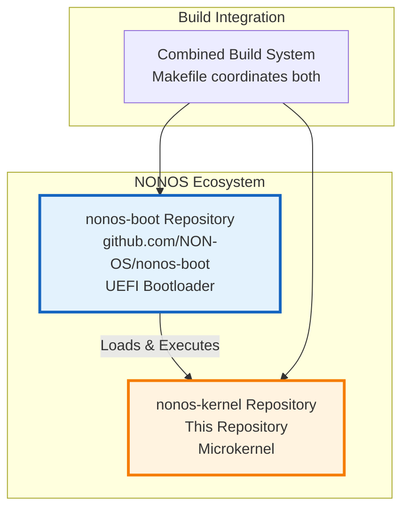
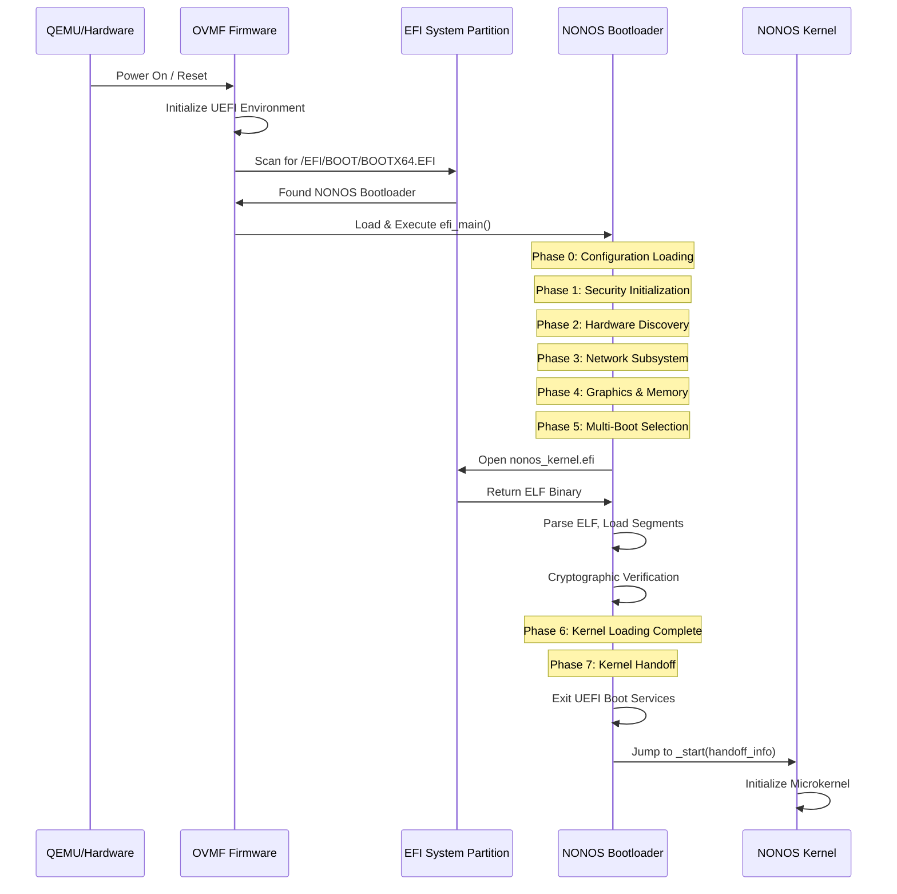
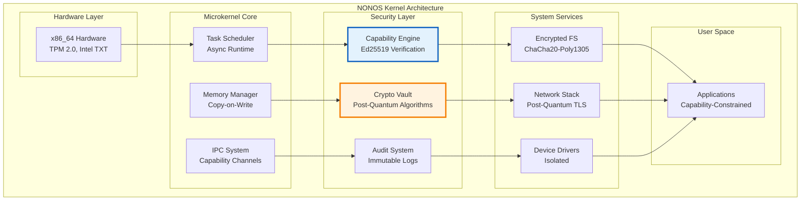
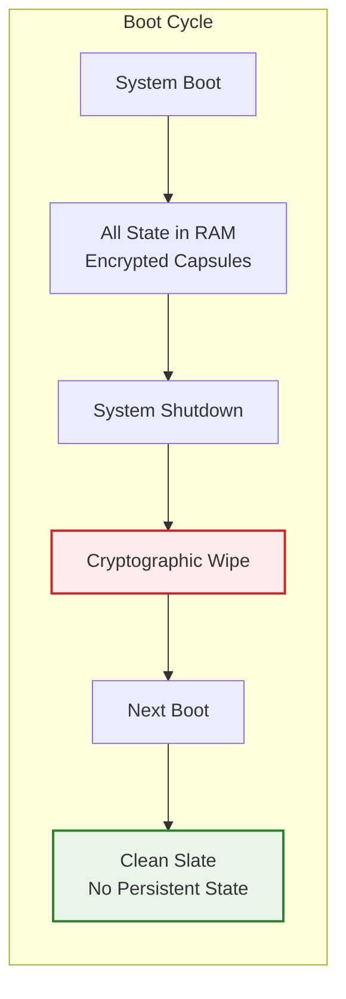
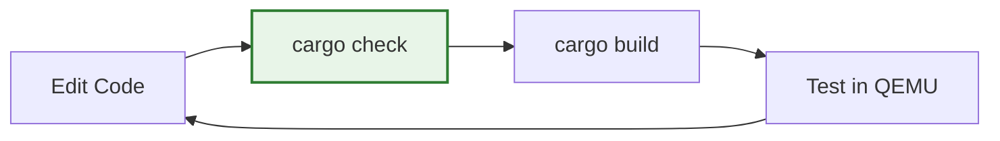
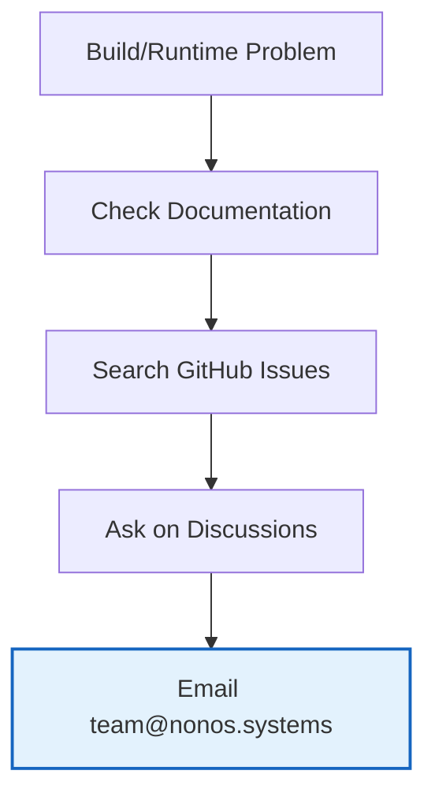

# NONOS Kernel

**A capability-based microkernel with post-quantum cryptography and zero-state architecture**

[](https://rustlang.org)
[](https://www.gnu.org/licenses/agpl-3.0)
[](https://github.com/nonos-kernel/nonos-kernel)

**Website**: [nonos.systems](https://nonos.systems) • **Contact**: [team@nonos.systems](mailto:team@nonos.systems)

---

## What is NONOS?

NONOS is a research microkernel designed around three core principles:

1. **Capability-based security** - Instead of users/groups, everything uses cryptographically-signed capability tokens
2. **Post-quantum cryptography** - Built-in support for quantum-resistant algorithms (Kyber, Dilithium, Ed25519)
3. **Zero-state architecture** - No persistent state survives reboots; everything is ephemeral and memory-resident

Think of it as: "What if we designed an OS from scratch knowing that quantum computers and nation-state attackers exist?"

### Key Features

- **Memory-safe** - Written in Rust, eliminates entire classes of vulnerabilities
- **Microkernel design** - Minimal kernel, everything else runs in user space
- **Real cryptographic security** - Every operation requires a valid capability token
- **Post-quantum ready** - Quantum-resistant cryptography built-in
- **Research platform** - Designed for security research and formal verification

---

## Quick Start

### Prerequisites

You'll need Rust nightly and some system tools:

```bash
# Install Rust nightly
curl --proto '=https' --tlsv1.2 -sSf https://sh.rustup.rs | sh
rustup install nightly
rustup default nightly

# Add bare metal target
rustup target add x86_64-unknown-none --toolchain nightly
```

**System packages:**

<details>
<summary><strong>Ubuntu/Debian</strong></summary>

```bash
sudo apt update
sudo apt install build-essential nasm qemu-system-x86 grub-pc-bin xorriso mtools
```
</details>

<details>
<summary><strong>Arch Linux</strong></summary>

```bash
sudo pacman -S base-devel nasm qemu grub xorriso mtools
```
</details>

<details>
<summary><strong>macOS</strong></summary>

```bash
brew install nasm qemu grub xorriso mtools
```
</details>

### Building

```bash
# Clone and build
git clone https://github.com/nonos-kernel/nonos-kernel.git
cd nonos-kernel

# Quick check (fast)
cargo check --target x86_64-nonos.json

# Debug build
cargo build --target x86_64-nonos.json

# Release build
cargo build --target x86_64-nonos.json --release
```

### Testing in QEMU

NONOS uses **modern UEFI boot** with OVMF firmware instead of legacy BIOS/ISO boot:

```bash
# Build complete system (bootloader + kernel + disk image)
make all

# Run in QEMU with UEFI firmware
make run

# Or use legacy build directory
make run-legacy
```

---

## UEFI Boot Process Explained

NONOS implements a sophisticated **two-stage UEFI boot process** using separate repositories for the bootloader and kernel. Understanding this process is essential for development and debugging.

### Repository Architecture



**Important:** The [nonos-boot](https://github.com/NON-OS/nonos-boot) repository must be present in the same directory structure for the build system to work correctly.

### UEFI vs Legacy Boot Comparison

| **Legacy BIOS/ISO Boot** | **NONOS UEFI Boot** |
|--------------------------|---------------------|
| ❌ 16-bit real mode startup | ✅ 64-bit long mode from start |
| ❌ MBR/bootloader complexity | ✅ Standard UEFI application |
| ❌ Limited pre-boot services | ✅ Rich UEFI runtime services |
| ❌ Manual memory management | ✅ UEFI memory services |
| ❌ Hardware detection from scratch | ✅ UEFI protocol detection |
| ❌ No secure boot support | ✅ UEFI secure boot ready |

### OVMF (Open Virtual Machine Firmware)

**OVMF** provides UEFI firmware for virtual machines, replacing traditional BIOS:

```bash
# OVMF Firmware Files (typically in /usr/share/OVMF/)
/usr/share/OVMF/
├── OVMF_CODE.fd          # Read-only firmware code
├── OVMF_VARS.fd          # Writable UEFI variables
├── OVMF_CODE.secboot.fd  # Secure Boot enabled variant
└── OVMF_VARS.ms.fd       # Microsoft-signed variables
```

**What OVMF provides:**
- **UEFI Runtime Services** - Memory management, variable storage, time services
- **Boot Services** - Device detection, protocol access, memory allocation  
- **Security Services** - Secure Boot, TPM support, verified boot chain
- **Standard Interfaces** - Graphics Output Protocol, Block I/O, File System access

### ESP (EFI System Partition)

The **ESP** is a **FAT32 partition** containing bootable UEFI applications:

```
build/esp/                    # EFI System Partition Contents
├── EFI/
│   └── BOOT/
│       └── BOOTX64.EFI      # NONOS UEFI Bootloader (PE32+)
│           │                # Target: x86_64-unknown-uefi
│           │                # Source: github.com/NON-OS/nonos-boot
│           └── Entry Point: efi_main()
└── nonos_kernel.efi         # NONOS Kernel Binary (ELF 64-bit)
    │                        # Target: x86_64-nonos.json  
    │                        # Source: This repository
    └── Entry Point: _start()
```

**Why this structure?**
- **`/EFI/BOOT/BOOTX64.EFI`** - Standard UEFI bootloader path (auto-discovered)
- **`nonos_kernel.efi`** - Kernel binary loaded by bootloader
- **FAT32 format** - Required by UEFI specification for ESP

### Complete Boot Sequence (Verified)



### Build Targets and File Types

**Bootloader Build:**
```bash
# In nonos-boot repository
cargo build --target x86_64-unknown-uefi --features "default,mock-proof"
# Produces: target/x86_64-unknown-uefi/debug/nonos_boot.efi (PE32+ executable)
# Copied to: build/esp/EFI/BOOT/BOOTX64.EFI
```

**Kernel Build:**
```bash  
# In this repository
cargo build --target x86_64-nonos.json
# Produces: target/x86_64-nonos/debug/nonos_kernel (ELF 64-bit executable)
# Copied to: build/esp/nonos_kernel.efi
```

**Final Artifacts:**
```
build/
├── esp/                     # EFI System Partition
│   ├── EFI/BOOT/BOOTX64.EFI # PE32+ UEFI Application (Bootloader)
│   └── nonos_kernel.efi     # ELF 64-bit Executable (Kernel)
├── nonos.img               # FAT32 Disk Image (67MB)
├── OVMF_VARS.fd           # UEFI Variables (Copied from system)
└── nonos.iso              # Legacy ISO (deprecated)
```

### Kernel Handoff Process

The bootloader transfers control using a structured handoff:

```rust
// Bootloader (main.rs:654-664)
let kernel_entry: KernelEntry = unsafe { 
    core::mem::transmute(kernel_capsule.entry_point) 
};
let handoff_ptr = &kernel_capsule.handoff as *const _;

unsafe {
    core::arch::asm!(
        "call {kernel_entry}",       // Call kernel  
        kernel_entry = in(reg) kernel_entry as usize,
        in("rdi") handoff_ptr,       // System V ABI: first arg in RDI
        options(noreturn)
    );
}
```

```rust
// Kernel (main.rs:67)
#[no_mangle]
pub extern "C" fn _start(boot_info: *const ZeroStateBootInfo) -> ! {
    // Kernel receives handoff information
    // Immediately outputs to serial: "KERNEL"
    // Continues with microkernel initialization
}
```

**Handoff Data Structure:**
```rust
#[repr(C, packed)]
pub struct ZeroStateBootInfo {
    pub magic: u64,           // Boot magic number
    pub abi_version: u16,     // ABI compatibility version
    pub boot_flags: u32,      // Boot configuration flags
    pub capsule_base: u64,    // Kernel image base address  
    pub capsule_size: u64,    // Kernel image size
    pub memory_start: u64,    // Usable memory start
    pub memory_size: u64,     // Total memory size
    pub entropy: [u8; 32],    // Boot entropy for RNG seeding
    pub rtc_utc: [u8; 8],     // Real-time clock timestamp
    // ... additional boot information
}
```

### Running the System

**Method 1: Complete Build**
```bash
make all                     # Build bootloader + kernel + disk image
make run                     # Run with target/build/ artifacts
```

**Method 2: Legacy Build Directory**
```bash
make run-legacy              # Run with build/ artifacts (faster)
```

**Method 3: Manual QEMU**
```bash
qemu-system-x86_64 \
  -machine pc -cpu host -enable-kvm -m 512M \
  -drive if=pflash,format=raw,readonly=on,file=/usr/share/OVMF/OVMF_CODE.fd \
  -drive if=pflash,format=raw,file=build/OVMF_VARS.fd \
  -drive format=raw,file=build/nonos.img \
  -serial stdio
```

### Boot Output Verification

**Successful boot shows:**
```
╔══════════════════════════════════════════════════════════════════════╗
║                    *** N0N-OS BOOT SUCCESS! ***                     ║
║              >>> UNIQUE OS - NOT ANOTHER LINUX CLONE! <<<           ║
╚══════════════════════════════════════════════════════════════════════╝

NØNOS ADVANCED BOOTLOADER - Version 0.4.0 - Enterprise
Phase 0: Configuration Loading
Phase 1: Security Initialization  
Phase 2: Hardware Discovery
Phase 3: Network Subsystem
Phase 4: Graphics & Memory
Phase 5: Multi-Boot & Boot Source Selection
Phase 6: Kernel Loading
Phase 7: Kernel Handoff
Transferring Control to N0N-OS Kernel

KERNEL                          # Kernel serial output
*** KERNEL _start() ENTRY POINT REACHED! ***
```

### Troubleshooting UEFI Boot Issues

| **Problem** | **Cause** | **Solution** |
|-------------|-----------|--------------|
| iPXE boot screen appears | OVMF can't find bootloader | Check `build/esp/EFI/BOOT/BOOTX64.EFI` exists |
| "Boot device not found" | Disk image malformed | Rebuild with `make clean && make all` |
| QEMU hangs at black screen | Wrong OVMF paths | Install OVMF: `apt install ovmf` |
| Bootloader starts but no kernel | Missing kernel binary | Check `build/esp/nonos_kernel.efi` exists |
| Build fails with UEFI errors | Missing Rust target | `rustup target add x86_64-unknown-uefi` |
| Serial output garbled | Wrong QEMU flags | Use `make run-legacy` instead |

### Development Workflow

```bash
# 1. Clone both repositories
git clone https://github.com/your-org/nonos-kernel.git
git clone https://github.com/NON-OS/nonos-boot.git

# 2. Ensure directory structure
nonos-project/
├── nonos-kernel/           # This repository
└── nonos-boot/            # Bootloader repository

# 3. Build and test
cd nonos-kernel
make clean                  # Clean all artifacts
make all                   # Build bootloader + kernel  
make run-legacy           # Test in QEMU
```

**Key Points:**
- ✅ **UEFI boot** provides modern, secure, 64-bit environment
- ✅ **Separate repositories** allow independent development
- ✅ **Structured handoff** ensures clean kernel initialization  
- ✅ **Rich debugging** via serial output and QEMU monitor
- ✅ **Cross-platform** works on Linux, macOS, Windows

---

## Architecture Overview



### How Capabilities Work

Instead of traditional permissions, NONOS uses cryptographic tokens:

```rust
// Example: File access capability
struct FileCapability {
    file_path: PathBuf,
    permissions: Permissions,  // READ, WRITE, EXECUTE
    expires_at: u64,          // Unix timestamp
    signature: [u8; 64],      // Ed25519 signature
}
```

To access `/etc/passwd`, you need a capability token signed by the file system authority. No token = no access.

### Zero-State Model



No persistent attack surface - everything gets wiped on reboot.

---

## Development

### Project Structure

```
nonos-kernel/
├── src/
│   ├── main.rs              # Kernel entry point
│   ├── capability/          # Capability system
│   ├── crypto/              # Cryptographic primitives
│   ├── memory/              # Memory management
│   ├── scheduler/           # Task scheduling
│   └── syscall/             # System call interface
├── x86_64-nonos.json        # Custom target spec
└── Cargo.toml               # Dependencies and features
```

### Feature Flags

Key features you can enable/disable:

```toml
[features]
# Cryptographic algorithms
nonos-crypto-ed25519 = ["ed25519-dalek"]
nonos-crypto-kyber = ["pqcrypto-kyber"] 
nonos-hash-sha3 = ["sha3"]

# Security hardening
nonos-heap-guard = []        # Guard pages around heap
nonos-kaslr = []             # Address space randomization
nonos-smap-smep = []         # Hardware isolation

# Debugging
nonos-log-serial = []        # Serial port logging
nonos-debug-trace = []       # Execution tracing
```

### Development Workflow



**Daily development:**
```bash
# Fast iteration cycle
cargo check --target x86_64-nonos.json
cargo build --target x86_64-nonos.json
make run  # Builds and runs in QEMU
```

---

## Troubleshooting

### Common Issues

| Problem | Solution |
|---------|----------|
| `error: toolchain 'nightly' is not installed` | `rustup install nightly` |
| `error: target 'x86_64-unknown-none' not found` | `rustup target add x86_64-unknown-none` |
| `qemu-system-x86_64: command not found` | Install QEMU: `sudo apt install qemu-system-x86` |
| Build hangs or fails randomly | `cargo clean && cargo build --target x86_64-nonos.json` |

### Getting Help



**Resources:**
- **Issues**: [GitHub Issues](https://github.com/nonos-kernel/nonos-kernel/issues)
- **Discussions**: [GitHub Discussions](https://github.com/nonos-kernel/nonos-kernel/discussions)
- **Email**: [team@nonos.systems](mailto:team@nonos.systems)

---

## Contributing

We welcome contributions! NONOS is a research project exploring the future of secure computing.

### Getting Started

1. **Read the code** - Start with `src/main.rs` and `src/capability/`
2. **Pick an issue** - Look for [good first issue](https://github.com/nonos-kernel/nonos-kernel/labels/good%20first%20issue) labels
3. **Join discussions** - Ask questions in GitHub Discussions
4. **Submit PRs** - Include tests and documentation

### Areas We Need Help

- **Architecture ports** - ARM64, RISC-V support
- **Performance optimization** - Benchmarking, profiling
- **Security auditing** - Code review, vulnerability research
- **Testing** - Unit tests, integration tests, fuzzing
- **Documentation** - Tutorials, API docs, examples

### Code Style

- **Memory safety first** - Minimize `unsafe` code
- **Document everything** - Especially security-critical code
- **Test everything** - Unit tests, integration tests
- **Follow Rust conventions** - Use `rustfmt` and `clippy`

---

## Research Applications

NONOS is designed as a research platform for:

- **Capability-based security models**
- **Post-quantum cryptography integration**
- **Formal verification of security properties**
- **Microkernel performance optimization**
- **Zero-knowledge proof systems**

**Academic collaborations welcome** - contact [team@nonos.systems](mailto:team@nonos.systems)

---

## License

**AGPL-3.0** - Open source with copyleft requirements.

For commercial use requiring proprietary modifications, contact [team@nonos.systems](mailto:team@nonos.systems) for licensing options.

---

## Contact

- **Website**: [nonos.systems](https://nonos.systems)
- **Email**: [team@nonos.systems](mailto:team@nonos.systems)
- **GitHub**: [nonos-kernel/nonos-kernel](https://github.com/nonos-kernel/nonos-kernel)
- **Security**: [security@nonos.systems](mailto:security@nonos.systems)

---

*NONOS - Rethinking OS security for the post-quantum era*