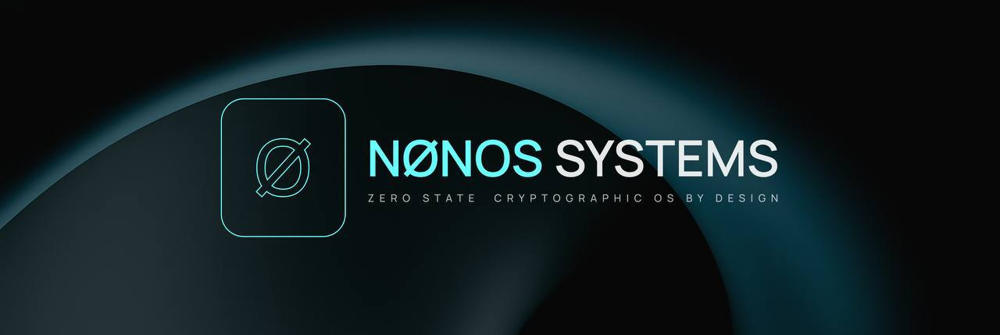

# NØNOS MICROKERNEL

**Zero-State capability-based security Microkernel**

  
  

Repository: https://github.com/NON-OS/nonos-kernel

---

## Overview

**NØNOS** is a security-first operating system designed around a simple architectural idea:

> A computing session should begin from a clean state and end without leaving persistent traces.

The system implements a **minimal microkernel architecture** written in **Rust**, combining capability-based security, hardware-aware isolation and a cryptographic integrity pipeline. Unlike traditional operating systems that accumulate persistent state across sessions, NØNOS follows a **Zero-State execution model**. The system runs entirely in memory and returns to a clean state once power is removed.

This repository contains the **core kernel implementation** and low-level components that form the foundation of the NØNOS operating system.

---

## Design Philosophy

The NØNOS architecture is guided by several principles.

### Zero-State Execution

The system does not maintain persistent operating system state between sessions.

No swap files, background persistence, or hibernation images exist by default. When power is removed, the system returns to a known clean state.

### Capability-Based Security

Access to system resources is governed through explicit capabilities rather than global privilege levels.

There is no traditional *root* model.

### Minimal Trusted Core

The kernel maintains a deliberately small and auditable trusted computing base.

### Cryptographic Integrity

Kernel artifacts are signed and verified during the build and boot process to ensure system integrity.

---

## Documentation

The complete technical documentation for NØNOS is hosted at:

**https://nonos.software/docs**

The documentation portal includes:

- Full architecture specification
- Kernel internals
- Memory architecture documentation
- Boot chain design
- Build instructions
- Installation guide
- Development roadmap

Rather than duplicating documentation across repositories, all official technical material is maintained centrally at **nonos.software**.

---

## Getting Started

If you are looking to:

• build NØNOS from source  
• download the latest ISO  
• run the system in QEMU  
• boot on real hardware  
• explore the kernel architecture  

Please follow the official documentation.

### Build Instructions

https://nonos.software/docs/build

### Installation Guide

https://nonos.software/docs/install

### Architecture Documentation

https://nonos.software/docs/architecture

### Development Roadmap

https://nonos.software/docs/roadmap

---

## Alpha Status

NØNOS is currently in **Alpha development**.

The system is under active iteration and certain kernel interfaces may evolve as the architecture matures.

The Alpha phase focuses on:

- kernel stability
- hardware compatibility
- memory isolation primitives
- networking stack development
- capability enforcement mechanisms

--
## Contributing

NØNOS is an open project and contributions are welcome.

Before contributing, please read the documentation and development notes at:

https://nonos.software/docs

Discussions about architecture and development directions take place through the repository and community channels.

---

## License

NØNOS is released under the **GNU AGPL-3.0 License**.

See the LICENSE file for details.

---

## Project Mission

NØNOS explores a different model of computing one where privacy and system integrity are not optional features, but architectural properties.

Building secure systems requires long-term collaboration between engineers, researchers, and the broader open-source community.

This project is one step toward that goal.

---

**NØNOS Sovereignty from ∅**
