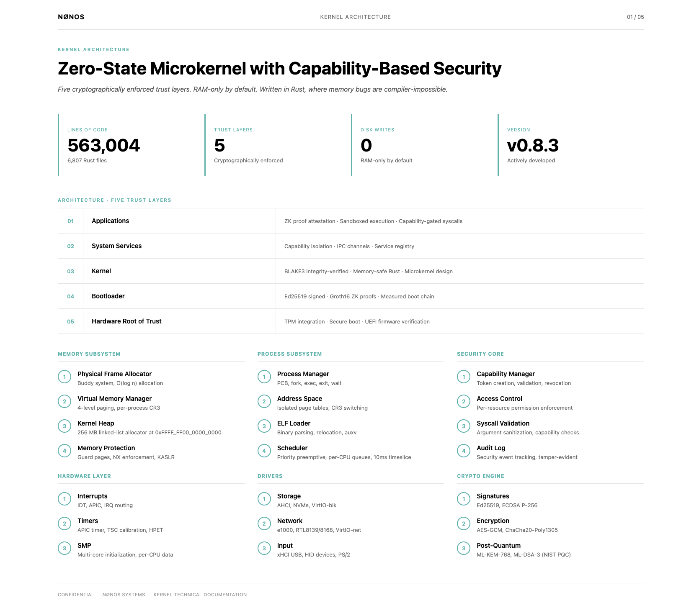
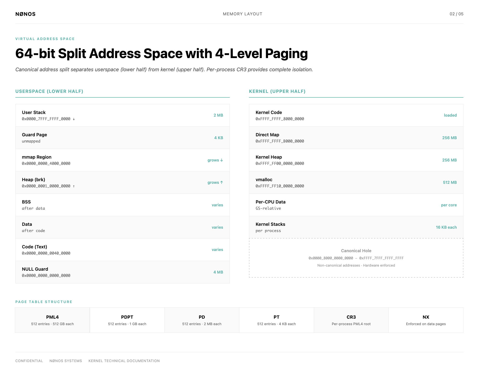
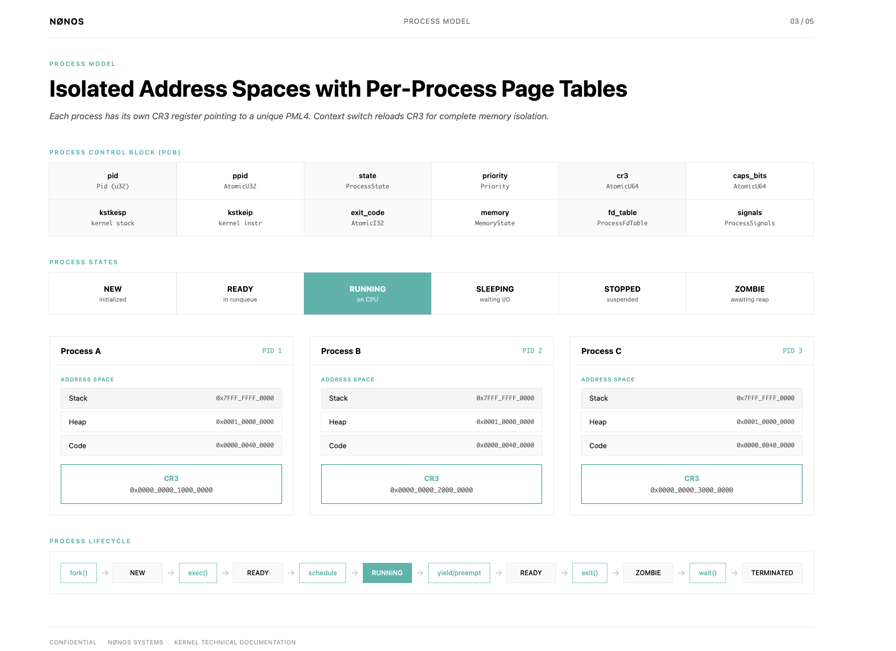
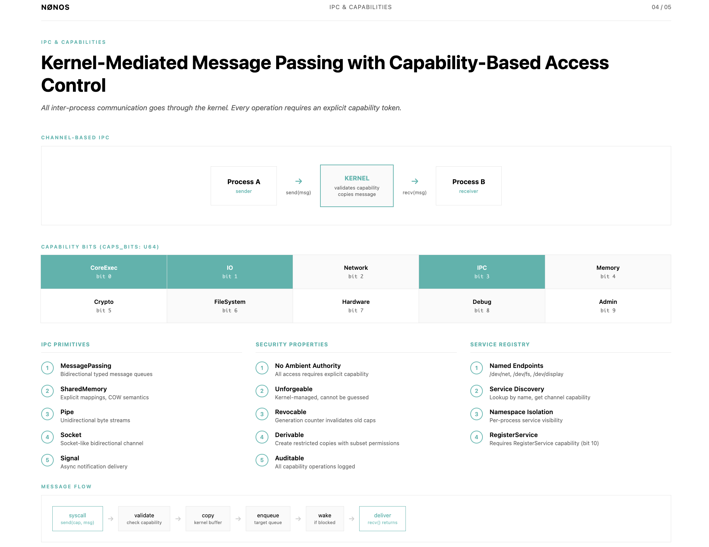
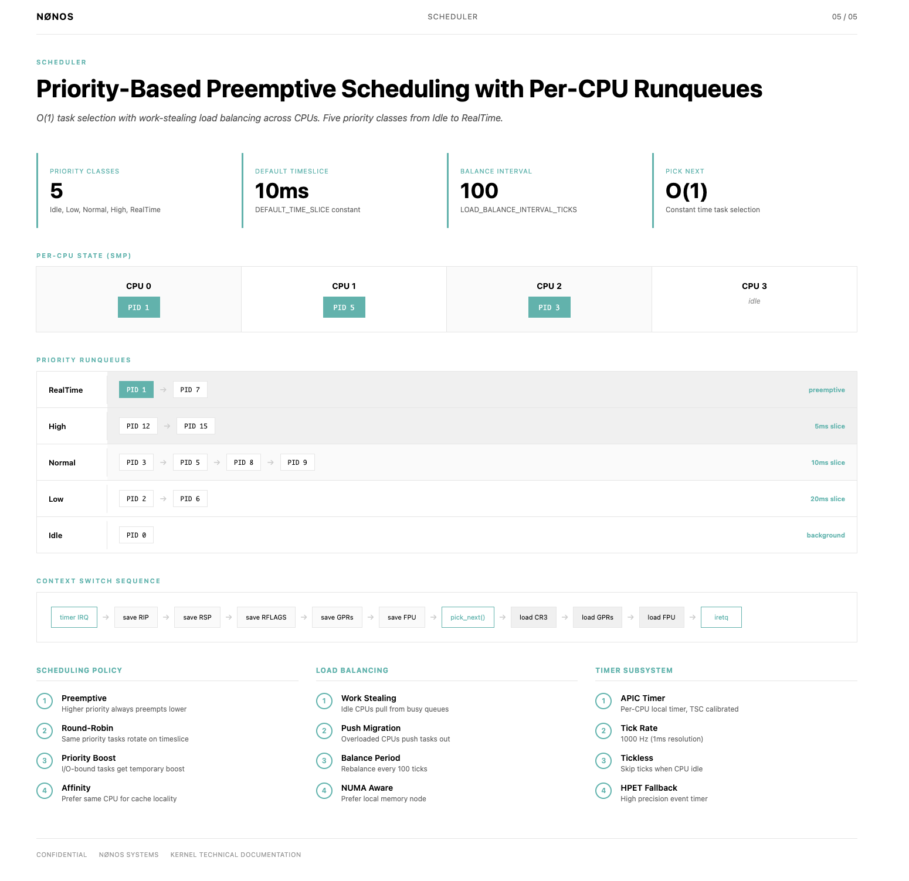
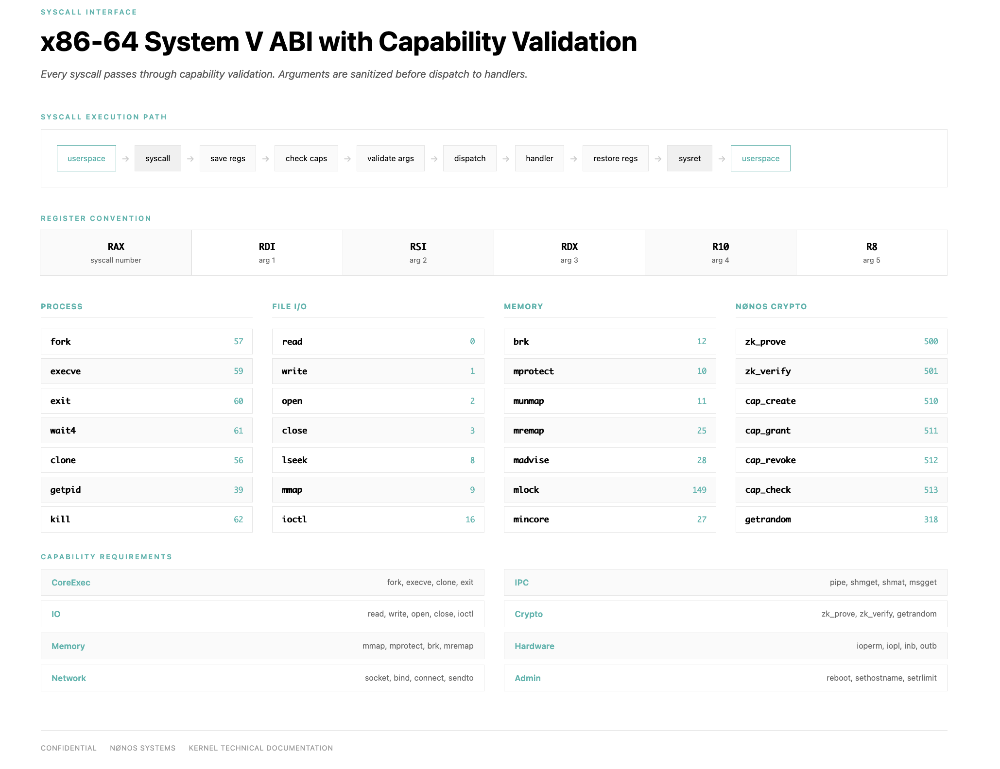

<p align="center">
  
</p>

<p align="center">
  <strong>Zero-State</strong> · <strong>Capability-Based</strong> · <strong>Privacy-First</strong>
</p>

<p align="center">
  <a href="#quick-start">Quick Start</a> •
  <a href="#architecture">Architecture</a> •
  <a href="#building">Building</a> •
  <a href="#running">Running</a> •
  <a href="#documentation">Docs</a>
</p>

---

## What Is This

NØNOS is an operating system built from scratch in Rust. The core idea is simple: a computing session should start clean and leave no trace when it ends.

No swap. No hibernation. No persistent OS state. When power goes away, the session is gone.

The kernel follows a capability-based security model. There's no root user, no global privilege escalation. Access to resources requires explicit capability grants, enforced by the kernel at every boundary.

Everything runs in isolated address spaces. Services communicate through IPC. The kernel mediates all cross-boundary operations.

This isn't a Linux derivative or a POSIX clone. It's a different model of computing where privacy and integrity are architectural properties, not features bolted on after the fact.

---

## Development Status

NØNOS is in active development, transitioning toward a microkernel architecture. The system boots, runs services, and handles real workloads, but correctness and isolation guarantees are still being validated.

Current focus: process isolation, IPC reliability, scheduler correctness.

Expect rapid iteration. This is a live build.

---

## Architecture

The diagram on top above shows the five trust layers that form the foundation of NØNOS. Each layer is cryptographically bound to the one below it. The bootloader validates the kernel through Ed25519 signatures before execution. The kernel verifies every capsule and service before loading. At the top, applications run in sandboxed environments with only the capabilities they were explicitly granted. This chain of verification starts at the hardware root of trust and extends all the way up to userspace. Nothing executes without proof of integrity.


### Five Trust Layers

| Layer | Name | Description |
|-------|------|-------------|
| 01 | Applications | ZK proof attestation, sandboxed execution, capability-gated syscalls |
| 02 | System Services | Capability isolation, IPC channels, service registry |
| 03 | Kernel | BLAKE3 integrity-verified, memory-safe Rust, microkernel design |
| 04 | Bootloader | Ed25519 signed, Groth16 ZK proofs, measured boot chain |
| 05 | Hardware Root of Trust | TPM integration, secure boot, UEFI firmware verification |

### Microkernel Design

The kernel handles only the essentials:
- Memory management and address space isolation
- Process scheduling and context switching
- Inter-process communication
- Capability enforcement
- Hardware abstraction for interrupts and timers

Everything else runs in userspace as isolated services. The filesystem, network stack, device drivers, and crypto services all run as separate processes. They communicate through typed IPC channels, and every operation requires an explicit capability check.

### Zero-State Execution

The system runs entirely in RAM. There's no persistent state by default. Boot from a verified image, do your work, power off. Nothing remains.

For workflows that need persistence, explicit encrypted vaults can be mounted. But the default is ephemeral. When you shut down, RAM is wiped. There's no hibernation image, no swap partition, no recovery files. Your session existed only while the machine was running.

### Capability-Based Security

Every resource access requires a capability token. Capabilities are unforgeable references that grant specific permissions to specific resources.

A process can only access what it's been explicitly granted. No ambient authority, no privilege inheritance, no confused deputy attacks. If a process doesn't have a capability, it can't even attempt the operation.

### Cryptographic Boot Chain

The bootloader verifies the kernel with Ed25519 signatures and Groth16 zero-knowledge proofs. The kernel is bound to the specific machine at attestation time. Tampering is mathematically detectable. The ZK proof attests that the kernel matches the expected hash without revealing the hash itself, enabling remote attestation while preserving privacy.

---

## Memory Layout

<p align="center">
  
</p>

This diagram shows how virtual memory is organized in NØNOS. The address space is split between userspace in the lower half and kernel space in the upper half, separated by the canonical hole that x86-64 requires. Each process gets its own page tables and sees only its own memory. The kernel is mapped into the upper half of every address space, but user code can't access it due to page table protections. The diagram shows key regions like the user stack growing downward, the heap growing upward, and the kernel's direct physical memory mapping that allows efficient access to hardware.

### Virtual Address Space

The kernel uses a 64-bit split address space with the canonical hole in the middle. Four-level paging (PML4 → PDPT → PD → PT). Each process has its own PML4, switched on context change via CR3.

**Userspace (lower half):**

| Region | Start | End | Size | Purpose |
|--------|-------|-----|------|---------|
| Code | `0x0000_0000_0040_0000` | varies | varies | Process executable (USER_CODE_START) |
| Heap | `0x0000_0001_0000_0000` | grows up | dynamic | brk/mmap allocations (USER_HEAP_START) |
| Stack | `0x0000_7FFF_FFFF_0000` | grows down | 2 MB | User stack (USER_STACK_BASE, USER_STACK_SIZE) |

**Kernel (upper half):**

| Region | Start | Size | Purpose |
|--------|-------|------|---------|
| Higher Half | `0xFFFF_8000_0000_0000` | — | Kernel base mapping |
| Direct Map | `0xFFFF_FFFF_B000_0000` | 256 MB | Physical memory window |
| Kernel Heap | `0xFFFF_FF00_0000_0000` | 256 MB | linked-list allocator arena |
| vmalloc | `0xFFFF_FF10_0000_0000` | 512 MB | Non-contiguous kernel allocations |

### Page Sizes

- 4 KB standard pages for fine-grained allocation
- 2 MB large pages for kernel mappings to reduce TLB pressure
- 1 GB huge pages for direct physical map when hardware supports it

Guard pages sit between stack regions to catch overflows. NX bit enforced on all data pages.

### Physical Memory

Frame allocator using buddy system for O(log n) allocation. Memory zones partition physical RAM:

| Zone | Range | Usage |
|------|-------|-------|
| DMA | 0 - 16 MB | Legacy device buffers requiring low addresses |
| Normal | 16 MB - 4 GB | General purpose allocations |
| High | > 4 GB | Large allocations, requires 64-bit addressing |

### Segment Selectors

GDT layout matching x86-64 long mode requirements:

| Selector | Segment | DPL | Constant |
|----------|---------|-----|----------|
| `0x08` | Kernel Code (64-bit) | 0 | KERNEL_CS |
| `0x10` | Kernel Data | 0 | KERNEL_DS |
| `0x1B` | User Code (64-bit) | 3 | USER_CS |
| `0x23` | User Data | 3 | USER_DS |

User code runs at ring 3. Kernel at ring 0. Syscalls via `syscall` instruction.

---

## Process Model

<p align="center">
  
</p>

The process model diagram illustrates how NØNOS manages isolated execution contexts. Each process has its own address space backed by separate page tables. When the kernel switches between processes, it loads the new process's CR3 register, completely changing the visible memory. The diagram shows the lifecycle from fork through execution to exit, and how parent-child relationships are tracked. Every process also carries a capability table that defines exactly what resources it can access.

### Process Control Block

Each process tracks:
- PID and parent PID
- Address space (CR3 root pointer)
- Capability table with all granted permissions
- File descriptor table for open files and sockets
- Signal handlers and pending signals
- Scheduling priority class
- CPU affinity mask for SMP placement

### Address Space Isolation

Every process runs in its own address space. The kernel maintains separate page tables per process. Context switch loads a new CR3 and flushes TLB (with PCID optimization when available).

```
Process A          Process B          Kernel
+---------+        +---------+        +---------+
| CR3_A   |        | CR3_B   |        | Shared  |
+---------+        +---------+        +---------+
| User    |        | User    |        | Kernel  |
| pages   |        | pages   |        | pages   |
| (priv)  |        | (priv)  |        | (mapped)|
+---------+        +---------+        +---------+
```

No process can access another's memory without explicit shared mapping granted through capabilities.

### Stack Configuration

| Type | Size | Constant |
|------|------|----------|
| User Stack | 2 MB | USER_STACK_SIZE |
| Kernel Stack | 16 KB | KERNEL_STACK_SIZE |

User RFLAGS initialized to `0x202` (interrupts enabled, reserved bit set).

---

## Inter-Process Communication

<p align="center">
  
</p>

This diagram shows how processes communicate in NØNOS. All IPC goes through the kernel. When process A wants to send a message to process B, it makes a syscall with the message and a capability proving it has permission to use that channel. The kernel validates the capability, copies the message to an internal buffer, enqueues it for the target, and wakes the receiver if it was blocked waiting. The capability bits shown in the diagram define what operations each process can perform. Without the right bits set, the kernel rejects the operation.

### Channels

Kernel-mediated message passing. Processes create channels and send typed messages.

```rust
Channel {
    sender: ProcessId,
    receiver: ProcessId,
    capacity: usize,
    messages: RingBuffer<Message>,
}
```

Both blocking and non-blocking modes are supported. Every channel operation requires a valid capability.

### IPC Primitives

| Primitive | Description |
|-----------|-------------|
| MessagePassing | Bidirectional typed message queues with structured payloads |
| SharedMemory | Explicit mappings with copy-on-write semantics |
| Pipe | Unidirectional byte streams for classic Unix-style IPC |
| Socket | Socket-like bidirectional channel for network-style communication |
| Signal | Async notification delivery for events and interrupts |

### Message Format

```rust
Message {
    type: MessageType,
    sender: ProcessId,
    payload: [u8; MAX_PAYLOAD],
    capabilities: [CapId; MAX_CAPS],
}
```

Messages can carry capability tokens, enabling delegation. A process can grant a subset of its permissions to another process by including capability IDs in the message payload.

### Message Flow

1. `syscall send(cap, msg)` - userspace initiates
2. Kernel validates capability ownership and permissions
3. Kernel copies message to internal buffer (no shared memory)
4. Kernel enqueues in target queue
5. Kernel wakes receiver if blocked on recv()
6. `recv()` returns in target process with message

---

## Scheduler

<p align="center">
  
</p>

The scheduler diagram shows how NØNOS manages CPU time across processes. Five priority classes from RealTime down to Idle determine who runs next. Each CPU maintains its own runqueue to minimize lock contention in SMP systems. The diagram shows the context switch sequence: timer interrupt fires, current state is saved, the scheduler picks the next task, the new state is loaded, and execution resumes. Work stealing balances load when one CPU goes idle while another is overloaded.

### Algorithm

Priority-based preemptive scheduling with round-robin within priority levels. O(1) task selection with work-stealing load balancing across CPUs.

### Priority Classes

| Class | Timeslice | Behavior |
|-------|-----------|----------|
| RealTime | preemptive | Always runs first, no time limit |
| High | 5ms | Short timeslice for responsive tasks |
| Normal | 10ms | Default for most processes |
| Low | 20ms | Background tasks |
| Idle | background | Only when nothing else to run |

### Constants (from source)

| Constant | Value | Description |
|----------|-------|-------------|
| MAX_CPUS | 256 | Maximum supported CPU cores |
| DEFAULT_TIME_SLICE | 10ms | Default quantum for Normal priority |
| LOAD_BALANCE_INTERVAL_TICKS | 100 | Ticks between rebalance checks |
| MIGRATION_THRESHOLD | 2 | Queue imbalance before migration |
| MAX_QUEUE_IMBALANCE | 4 | Maximum allowed queue length difference |

### Runqueue

Per-CPU runqueues to minimize lock contention:

```rust
Runqueue {
    current: Option<TaskId>,
    queues: [Vec<TaskId>; NUM_PRIORITIES],
    idle_task: TaskId,
}
```

### Scheduling Policy

1. **Preemptive**: Higher priority always preempts lower immediately
2. **Round-Robin**: Same priority tasks rotate on timeslice expiry
3. **Priority Boost**: I/O-bound tasks get temporary boost after waking
4. **Affinity**: Prefer same CPU for cache locality

### Load Balancing

1. **Work Stealing**: Idle CPUs pull from busy queues
2. **Push Migration**: Overloaded CPUs push tasks out
3. **Balance Period**: Rebalance every 100 ticks
4. **NUMA Aware**: Prefer local memory node

### Context Switch Sequence

1. Timer IRQ fires on APIC timer
2. Save RIP, RSP, RFLAGS to kernel stack
3. Save general-purpose registers (RAX-R15)
4. Save FPU/SSE state (lazy save optimization)
5. Call `pick_next()` to select next task from runqueue
6. Load new CR3 (switches address space)
7. Load general-purpose registers from new task
8. Load FPU state if task used FPU
9. Execute `iretq` to return to new process

---

## System Calls

<p align="center">
  
</p>

The syscall diagram shows the interface between userspace and the kernel. Register conventions follow System V ABI: RAX holds the syscall number, RDI through R9 hold arguments. The execution path shows every step from the `syscall` instruction through capability validation, argument sanitization, dispatch, handling, and return via `sysret`. Every syscall checks capabilities before executing. The diagram also shows the custom NØNOS syscalls for ZK proofs, capability management, and IPC alongside standard POSIX-compatible syscalls.

### Interface

`syscall` instruction with System V ABI:

| Register | Purpose |
|----------|---------|
| RAX | syscall number |
| RDI | argument 1 |
| RSI | argument 2 |
| RDX | argument 3 |
| R10 | argument 4 |
| R8 | argument 5 |
| R9 | argument 6 |
| RAX | return value |

### Syscall Execution Path

1. Userspace executes `syscall` instruction
2. CPU saves RIP/RSP, switches to ring 0
3. Kernel saves full register state to kernel stack
4. Kernel checks capability for the requested operation
5. Kernel validates and sanitizes all arguments
6. Kernel dispatches to appropriate handler
7. Handler executes operation
8. Kernel restores registers
9. `sysret` returns to userspace at ring 3

### Core Syscalls

| Number | Name | Description |
|--------|------|-------------|
| 0 | read | Read from file descriptor |
| 1 | write | Write to file descriptor |
| 2 | open | Open file |
| 3 | close | Close file descriptor |
| 9 | mmap | Map memory region |
| 10 | mprotect | Change memory protection |
| 11 | munmap | Unmap memory region |
| 12 | brk | Adjust heap break |
| 39 | getpid | Get process ID |
| 56 | clone | Create thread or process |
| 57 | fork | Create child process |
| 59 | execve | Execute program |
| 60 | exit | Terminate process |
| 62 | kill | Send signal |
| 158 | arch_prctl | Set FS/GS base |
| 318 | getrandom | Get random bytes |

### IPC Syscalls

| Number | Name | Description |
|--------|------|-------------|
| 800 | ipc_send | Send message to channel |
| 801 | ipc_recv | Receive message from channel |
| 802 | ipc_create | Create IPC channel |
| 803 | ipc_destroy | Destroy channel |

### Crypto Syscalls

| Number | Name | Description |
|--------|------|-------------|
| 900 | crypto_random | Get cryptographic random bytes |
| 901 | crypto_hash | Compute hash |
| 902 | crypto_sign | Sign data |
| 903 | crypto_verify | Verify signature |
| 904 | crypto_encrypt | Encrypt data |
| 905 | crypto_decrypt | Decrypt data |
| 906 | crypto_keygen | Generate key pair |
| 907 | crypto_zk_prove | Generate ZK proof |
| 908 | crypto_zk_verify | Verify ZK proof |

### Capability Syscalls

| Number | Name | Description |
|--------|------|-------------|
| 1203 | cap_grant | Grant capability to process |
| 1204 | cap_revoke | Revoke capability |
| 0x1032 | cap_check | Check capability permission |

### Microkernel Syscalls (0x1000+)

| Number | Name | Description |
|--------|------|-------------|
| 0x1000 | mk_ipc_send | Microkernel IPC send |
| 0x1001 | mk_ipc_recv | Microkernel IPC receive |
| 0x1002 | mk_ipc_call | Microkernel IPC call (send + recv) |
| 0x1010 | mk_mmap | Microkernel memory map |
| 0x1011 | mk_munmap | Microkernel memory unmap |
| 0x1020 | mk_spawn | Microkernel process spawn |
| 0x1021 | mk_exit | Microkernel process exit |
| 0x1022 | mk_yield | Microkernel yield |
| 0x1030 | mk_cap_grant | Microkernel capability grant |
| 0x1031 | mk_cap_revoke | Microkernel capability revoke |
| 0x1032 | mk_cap_check | Microkernel capability check |

---

## Capabilities

### Token Structure

```rust
Capability {
    id: u64,
    resource: ResourceId,
    permissions: PermissionBits,
    owner: ProcessId,
}
```

### Capability Bits (`caps_bits: u64`)

| Bit | Value | Capability | Description |
|-----|-------|------------|-------------|
| 0 | 1 | CoreExec | fork, execve, clone, exit |
| 1 | 2 | IO | read, write, open, close, ioctl |
| 2 | 4 | Network | socket, bind, connect, sendto |
| 3 | 8 | IPC | pipe, shmget, shmat, msgget, ipc_send |
| 4 | 16 | Memory | mmap, mprotect, brk, mremap |
| 5 | 32 | Crypto | zk_prove, zk_verify, getrandom |
| 6 | 64 | FileSystem | filesystem operations |
| 7 | 128 | Hardware | ioperm, iopl, inb, outb |
| 8 | 256 | Debug | debugging operations |
| 9 | 512 | Admin | reboot, sethostname, setrlimit |
| 10 | 1024 | RegisterService | register system services |

### Security Properties

1. **No Ambient Authority**: All access requires explicit capability
2. **Unforgeable**: Kernel-managed, cannot be guessed or fabricated
3. **Revocable**: Generation counter invalidates old capabilities
4. **Derivable**: Create restricted copies with subset permissions
5. **Auditable**: All capability operations logged

### Enforcement

Every resource access checks capability:

1. Process presents capability ID in syscall
2. Kernel validates ownership and generation
3. Kernel checks permission bits against requested operation
4. Access granted or denied with appropriate error

---

## Security Hardening

All security features are enabled by default. Only disable for debugging.

### Memory Protection

| Feature | Description |
|---------|-------------|
| heap-guard | 4KB guard pages before/after heap allocations |
| wx-audit | W^X enforcement - no page both writable AND executable |
| page-zero | Unmaps 0x0, NULL dereferences trap immediately |
| kaslr | Randomizes kernel base address using RDRAND/RDSEED |
| nx-stack | NX bit on all stack pages |
| stack-protector | Stack canaries between locals and return address |
| fortify | Runtime bounds checking for memcpy, strcpy, etc |

### CPU Security

| Feature | Description |
|---------|-------------|
| pcid | Process-Context Identifiers for TLB efficiency |
| smap-smep | Kernel can't access/execute user memory |
| cet | Intel Control-flow Enforcement (11th gen+, Zen 3+) |
| pti | Page table isolation (Meltdown mitigation) |
| ibrs | Indirect branch restricted speculation (Spectre v2) |
| ssbd | Speculative store bypass disable (Spectre v4) |
| mds | Microarchitectural data sampling mitigations |
| tsx-disable | Disable TSX to prevent TAA attacks |
| l1tf | L1 terminal fault mitigations |
| srso | Speculative return stack overflow (AMD) |

### Hardware Security

| Feature | Description |
|---------|-------------|
| secureboot | Validates UEFI secure boot chain |
| tpm | TPM 2.0 measured boot, PCR extend on each stage |
| dma-guard | IOMMU protection against DMA attacks |
| iommu | Intel VT-d / AMD-Vi for device isolation |

---

## Cryptography

### Signatures

| Algorithm | Implementation | Notes |
|-----------|----------------|-------|
| Ed25519 | Internal + dalek | Primary signing algorithm |
| ECDSA P-256 | Internal | NIST curve |
| secp256k1 | Internal | Ethereum/Bitcoin compatible |

### Encryption

| Algorithm | Implementation | Notes |
|-----------|----------------|-------|
| AES-256-GCM | Internal (AES-NI accelerated) | Primary symmetric cipher |
| AES-256-GCM-SIV | Internal | Nonce-misuse resistant |
| ChaCha20-Poly1305 | Internal | Alternative to AES |
| XChaCha20-Poly1305 | Internal | Extended nonce variant |

### Key Exchange

| Algorithm | Implementation | Notes |
|-----------|----------------|-------|
| X25519 | Internal + dalek | Curve25519 ECDH |

### Hashing

| Algorithm | Implementation | Notes |
|-----------|----------------|-------|
| BLAKE3 | blake3 crate | Fast, primary hash |
| SHA-256/384/512 | Internal | SHA-2 family |
| SHA3-256/384/512 | sha3 crate | SHA-3 family |

### Post-Quantum Cryptography

NIST FIPS 203/204 compliant implementations:

**ML-KEM (Key Encapsulation):**

| Level | Security | Ciphertext Size |
|-------|----------|-----------------|
| ML-KEM-512 | ~AES-128 | 800 bytes |
| ML-KEM-768 | ~AES-192 | 1088 bytes (recommended) |
| ML-KEM-1024 | ~AES-256 | 1568 bytes |

**ML-DSA (Digital Signatures):**

| Level | Security | Signature Size |
|-------|----------|----------------|
| ML-DSA-44 | ~AES-128 | 2420 bytes |
| ML-DSA-65 | ~AES-192 | 3293 bytes (recommended) |
| ML-DSA-87 | ~AES-256 | 4595 bytes |

**SLH-DSA (Hash-Based Signatures):**

| Variant | Signature Size | Notes |
|---------|----------------|-------|
| SLH-DSA-SHAKE-128f | 17 KB | Fast variant |
| SLH-DSA-SHAKE-128s | 7 KB | Small variant |
| SLH-DSA-SHAKE-256f | larger | Higher security |
| SLH-DSA-SHAKE-256s | medium | Higher security, small |

### Zero-Knowledge Proofs

| System | Trusted Setup | Proof Size | Verify Time | Use Case |
|--------|---------------|------------|-------------|----------|
| Groth16 | Yes (powers-of-tau) | ~200 bytes | ~10ms | Boot attestation |
| PLONK | Yes | ~500 bytes | ~50ms | General circuits |
| Bulletproofs | No | ~1KB | ~100ms | Range proofs |
| STARK | No | 50-200KB | ~200ms | Post-quantum |

---

## Drivers

### Storage

| Driver | Hardware | Feature Flag |
|--------|----------|--------------|
| AHCI | SATA controllers (ICH6+, most motherboards) | drivers-ahci |
| NVMe | PCIe NVMe SSDs | drivers-nvme |
| VirtIO-blk | QEMU/KVM virtual block devices | drivers-virtio-blk |
| Ramdisk | RAM-backed block device | drivers-ramdisk |
| Loopback | File-backed block device | drivers-loopback |

### Network

| Driver | Hardware | Feature Flag |
|--------|----------|--------------|
| VirtIO-net | QEMU/KVM virtual network | drivers-virtio-net |
| e1000 | Intel PRO/1000 (82540EM) | drivers-e1000 |
| e1000e | Intel 82574L GbE | drivers-e1000e |
| igb | Intel I350/I210 GbE | drivers-igb |
| igc | Intel I225/I226 2.5GbE | drivers-igc |
| ixgbe | Intel 82599 10GbE | drivers-ixgbe |
| ice | Intel E810 100GbE | drivers-ice |
| RTL8139 | Realtek RTL8139 (legacy) | drivers-rtl8139 |
| RTL8168 | Realtek RTL8111/8168 GbE | drivers-rtl8168 |
| r8152 | Realtek USB Ethernet | drivers-r8152 |
| mlx5 | Mellanox ConnectX-5/6 | drivers-mlx5 |

### USB

| Driver | Hardware | Feature Flag |
|--------|----------|--------------|
| xHCI | USB 3.0/3.1/3.2 controllers | drivers-usb-xhci |
| EHCI | USB 2.0 controllers | drivers-usb-ehci |
| USB Mass Storage | USB drives | drivers-usb-mass |
| USB HID | Keyboards, mice | drivers-usb-hid |
| USB Serial | USB-to-serial adapters | drivers-usb-serial |

### Display

| Driver | Hardware | Feature Flag |
|--------|----------|--------------|
| Framebuffer | Linear framebuffer from bootloader | drivers-framebuffer |
| VESA | VESA BIOS Extensions | drivers-vesa |
| VirtIO-GPU | QEMU/KVM virtual GPU | drivers-virtio-gpu |
| Bochs VBE | QEMU -vga std | drivers-bochs-vbe |
| VMware SVGA | VMware virtual display | drivers-vmware-svga |

### Sound

| Driver | Hardware | Feature Flag |
|--------|----------|--------------|
| AC'97 | Intel AC'97 (legacy) | drivers-ac97 |
| HD Audio | Intel HD Audio | drivers-hda |
| VirtIO-snd | QEMU/KVM virtual sound | drivers-virtio-snd |

### Platform

| Driver | Purpose | Feature Flag |
|--------|---------|--------------|
| PCI | PCI/PCIe enumeration | drivers-pci |
| ACPI | Power management, tables | drivers-acpi |
| RTC | Real-time clock (0x70/0x71) | drivers-rtc |
| Serial | 16550 UART | drivers-serial |
| HPET | High Precision Event Timer | drivers-hpet |
| PIT | Legacy 8254 timer | drivers-pit |
| PIC | Legacy 8259 interrupt controller | drivers-pic |
| I/O APIC | Advanced interrupt routing | drivers-ioapic |
| TSC | Timestamp counter | drivers-tsc |
| SMBIOS | System information | drivers-smbios |
| EFI | EFI runtime services | drivers-efi |
| TPM | TPM 2.0 security module | drivers-tpm |

### VirtIO

| Driver | Purpose | Feature Flag |
|--------|---------|--------------|
| VirtIO-RNG | Entropy source | drivers-virtio-rng |
| VirtIO-9P | Filesystem passthrough | drivers-virtio-9p |
| VirtIO-vsock | Host<->guest sockets | drivers-virtio-vsock |
| VirtIO-mem | Memory hotplug | drivers-virtio-mem |
| VirtIO-balloon | Memory ballooning | drivers-virtio-balloon |
| VirtIO-console | Virtual console | drivers-virtio-console |
| VirtIO-crypto | Hardware crypto offload | drivers-virtio-crypto |

---

## Network Stack

Built on smoltcp with full BSD socket API compatibility.

### Protocols

| Protocol | Feature Flag | Description |
|----------|--------------|-------------|
| IPv4 | net-ipv4 | IPv4, ARP, ICMP |
| IPv6 | net-ipv6 | IPv6, NDP, ICMPv6 |
| TCP | net-tcp | TCP with Reno congestion control |
| TCP BBR | net-tcp-bbr | BBR congestion control |
| TCP CUBIC | net-tcp-cubic | CUBIC congestion control |
| UDP | net-udp | UDP datagrams |
| ICMP | net-icmp | Ping support |
| DNS | net-dns | Stub resolver with DNSSEC |
| DHCP | net-dhcp | DHCPv4 client |
| DHCPv6 | net-dhcpv6 | DHCPv6 client |
| TLS 1.3 | net-tls | rustls-based TLS |
| QUIC | net-quic | HTTP/3 transport |
| WireGuard | net-wireguard | WireGuard VPN |

### Privacy Networking

| Protocol | Feature Flag | Description |
|----------|--------------|-------------|
| Onion | nonos-onion | Tor-compatible onion routing |
| NYM | nonos-nym | NYM mixnet (Sphinx packets, Loopix timing) |
| Dandelion++ | nonos-dandelion | Transaction relay privacy |
| I2P | nonos-i2p | I2P garlic routing |

---

## Filesystems

### Virtual Filesystems

| Filesystem | Mount Point | Feature Flag | Description |
|------------|-------------|--------------|-------------|
| tmpfs | /tmp | fs-tmpfs | In-memory, cleared on reboot |
| devfs | /dev | fs-devfs | Device nodes |
| procfs | /proc | fs-procfs | Process information |
| sysfs | /sys | fs-sysfs | Kernel/device configuration |
| debugfs | /sys/kernel/debug | fs-debugfs | Debugging interfaces |
| securityfs | /sys/kernel/security | fs-securityfs | LSM interfaces |
| configfs | /sys/kernel/config | fs-configfs | Userspace-driven config |
| tracefs | /sys/kernel/tracing | fs-tracefs | ftrace interface |
| cryptofs | /secure | fs-cryptofs | Encrypted, keys wiped on logout |

### Disk Filesystems

| Filesystem | Feature Flag | Description |
|------------|--------------|-------------|
| ext4 | fs-ext4 | Linux ext4 with full journal |
| FAT32 | fs-fat32 | UEFI ESP and USB drives |
| Btrfs | fs-btrfs | CoW, snapshots, compression |
| XFS | fs-xfs | Large file support |
| F2FS | fs-f2fs | Flash-friendly filesystem |
| SquashFS | fs-squashfs | Read-only compressed |
| OverlayFS | fs-overlayfs | Union mount for containers |
| FUSE | fs-fuse | Userspace filesystem support |
| 9P | fs-9p | Plan 9 protocol, VM file sharing |
| NFS | fs-nfs | NFSv4 client |

---

## Quick Start

### Prerequisites

**Rust Toolchain:**

```bash
# Install rustup if not present
curl --proto '=https' --tlsv1.2 -sSf https://sh.rustup.rs | sh

# Install the pinned nightly toolchain
rustup install nightly-2026-01-16
rustup target add x86_64-unknown-uefi --toolchain nightly-2026-01-16
rustup component add rust-src clippy rustfmt --toolchain nightly-2026-01-16
```

**QEMU:**

```bash
# macOS
brew install qemu

# Ubuntu/Debian
apt install qemu-system-x86

# Fedora
dnf install qemu-system-x86
```

**Optional - VirtualBox:**

```bash
# macOS
brew install --cask virtualbox

# Or download from virtualbox.org
```

**Optional - ISO Creation:**

```bash
# macOS
brew install xorriso gptfdisk mtools

# Ubuntu/Debian
apt install xorriso gdisk mtools
```

### Build and Run

```bash
git clone https://github.com/NON-OS/nonos-kernel.git
cd nonos-kernel
make run
```

That's it. The build handles toolchain setup, key generation, ZK ceremony, and boots into QEMU.

---

## Building

### Full Build Pipeline

```bash
make all
```

This runs the complete pipeline:

1. **Toolchain verification** - Installs nightly-2026-01-16 if missing
2. **Signing key generation** - Creates Ed25519 key pair (if missing)
3. **ZK trusted setup** - Generates Groth16 proving/verifying keys (if missing)
4. **Bootloader compilation** - Builds UEFI bootloader for x86_64-unknown-uefi
5. **Kernel compilation** - Builds kernel for x86_64-nonos custom target
6. **Ed25519 signing** - Signs kernel binary
7. **ZK proof generation** - Generates Groth16 attestation proof
8. **EFI System Partition** - Creates bootable ESP directory

**Build Output:**

```
Building UEFI bootloader...
    Finished `release` profile [optimized] target(s) in 2m 04s

Building kernel...
    Finished `release` profile [optimized] target(s) in 0.83s

Signing kernel with Ed25519...
Kernel: 321163912 bytes
Signature: 64 bytes
Footer: 64 bytes (NONOSIMG)
Public key: 3752c56fc79dc4b3eb6d2ab9a5a358a5b74ef762f15f26f27f62d1d1708c67c1
Output: target/kernel_signed.bin (321164040 bytes)

Generating and embedding ZK attestation proof...
=== NONOS ZK Attestation Prover ===

Signed kernel: 321164040 bytes
Kernel code: 321163912 bytes
Kernel BLAKE3: b63689e4264b32fce4e30bc46493b15ba4dedc841562d8f5b7d070e18793361b
Boot nonce: 2ac1ecedc226222f
Machine ID: d503a44606b130af

Generating Groth16 proof...
Proof generated: 192 bytes
Public inputs: 320 bytes

Written: target/kernel_attested.bin (321164728 bytes)

Creating EFI System Partition...
ESP ready at target/esp
```

### Individual Build Targets

```bash
# Build components separately
make bootloader      # Build UEFI bootloader only
make kernel          # Build kernel only
make sign-kernel     # Sign kernel with Ed25519
make embed-zk-proof  # Generate ZK attestation proof
make esp             # Create EFI System Partition

# Cryptographic keys
make ensure-signing-key  # Generate signing key if missing
make ensure-zk-keys      # Generate ZK keys if missing
make generate-zk-keys    # Force regenerate ZK keys
make zk-tools            # Build ZK attestation tools
```

### Code Quality

```bash
make fmt      # Format code with rustfmt
make check    # Run clippy lints
make test     # Run test suite
```

### Minimal Build

For embedded or minimal deployments:

```bash
cargo build --release --no-default-features --features "kernel,standalone"
```

This produces a ~200KB kernel with only the essentials.

### Environment Variables

| Variable | Default | Description |
|----------|---------|-------------|
| SIGNING_KEY | `nonos-bootloader/keys/signing_key_v1.bin` | Path to Ed25519 signing key |
| VERSION | git describe | Release version tag |
| RELEASE_VERSION | 0.8.4 | Fixed release version |
| SOURCE_DATE_EPOCH | git log timestamp | For reproducible builds |
| CARGO_INCREMENTAL | 0 | Disabled for reproducibility |

---

## Running

### QEMU (Development)

```bash
make run
```

**QEMU Configuration:**

| Setting | Value |
|---------|-------|
| Memory | 2 GB |
| CPU | max (host features) |
| SMP | 2 cores |
| Machine | Q35 (PCIe, ICH9) |
| Network | VirtIO-net with port forwarding |
| USB | xHCI controller + tablet |
| RNG | VirtIO-RNG |
| Display | VGA standard |

**Port Forwarding:**

| Host Port | Guest Port | Service |
|-----------|------------|---------|
| 2222 | 22 | SSH |
| 8080 | 80 | HTTP |

**Access:**

```bash
# SSH into the running system
ssh -p 2222 localhost

# Access HTTP server
curl http://localhost:8080

# Quit QEMU
Ctrl+A then X
```

### QEMU Serial Only

```bash
make run-serial
```

Boots without graphical display, serial output to terminal.

### QEMU Debug Mode

```bash
make debug
```

Starts with GDB server on port 1234, paused at entry:

```bash
# In another terminal
gdb target/x86_64-nonos/release/nonos-kernel \
    -ex 'target remote :1234'
```

### QEMU Flags Explained

```bash
qemu-system-x86_64 \
    -m 2G \                           # 2GB RAM
    -cpu max \                        # All CPU features available
    -smp 2 \                          # 2 CPU cores
    -machine q35 \                    # Q35 chipset (PCIe, ICH9)
    -drive "format=raw,file=fat:rw:target/esp" \  # ESP as FAT drive
    -drive if=pflash,format=raw,unit=0,readonly=on,file="OVMF.fd" \  # UEFI firmware
    -drive if=pflash,format=raw,unit=1,readonly=on,file="OVMF_VARS.fd" \  # UEFI vars
    -device virtio-net-pci,netdev=net0 \  # VirtIO network
    -netdev user,id=net0,hostfwd=tcp::2222-:22,hostfwd=tcp::8080-:80 \
    -device qemu-xhci,id=xhci \       # USB 3.0 controller
    -device usb-tablet,bus=xhci.0 \   # USB tablet (better mouse)
    -device virtio-rng-pci \          # Hardware RNG
    -serial mon:stdio \               # Serial + QEMU monitor
    -vga std \                        # Standard VGA
    -no-reboot                        # Halt instead of reboot on crash
```

### VirtualBox

```bash
# Create VM and boot
make run-vbox

# Or just create VM
make vbox-create

# Delete VM
make vbox-delete
```

**VirtualBox VM Configuration:**

| Setting | Value |
|---------|-------|
| Chipset | ICH9 (Q35 equivalent) |
| Firmware | EFI 64-bit |
| Memory | 2048 MB |
| CPUs | 2 |
| Video RAM | 128 MB |
| Graphics | VBoxSVGA |
| NIC | Intel 82545EM (NAT) |
| USB | xHCI (USB 3.0) |
| Storage | SATA (IntelAhci) |
| SSH | Port 2222 forwarded to 22 |

### Bootable Media

**ISO Image:**

```bash
make iso
# Creates: target/nonos.iso
```

**USB Image:**

```bash
make usb
# Creates: target/nonos.img (400 MB)

# Write to USB drive
sudo dd if=target/nonos.img of=/dev/sdX bs=4M status=progress
sync
```

**Warning:** Replace `/dev/sdX` with your actual USB device.

### Real Hardware Requirements

| Requirement | Minimum | Recommended |
|-------------|---------|-------------|
| CPU | x86_64 with SSE4.2 | Intel 11th gen+ / AMD Zen 3+ |
| RAM | 1 GB | 2 GB+ |
| Firmware | UEFI (no legacy BIOS) | UEFI 2.5+ |
| Secure Boot | Disabled | Disabled (NØNOS handles verification) |
| TPM | Optional | TPM 2.0 for measured boot |

---

## Release Build

```bash
make ci-release
```

Creates release artifacts with checksums:

```
target/release/
├── nonos-v0.8.4.iso      # Bootable ISO
├── nonos-v0.8.4.img      # USB image
├── kernel-v0.8.4.bin     # Signed kernel
└── SHA256SUMS            # Checksums
```

Verify checksums:

```bash
make verify
# Or manually:
cd target/release && sha256sum -c SHA256SUMS
```

---

## Source Layout

```
nonos-kernel/
├── src/
│   ├── agents/             # AI agent framework
│   │   ├── executor/       # Agent execution engine
│   │   ├── llm/            # LLM integration
│   │   └── tools/          # Agent tools
│   ├── apps/               # Application framework
│   │   ├── ecosystem/      # Built-in applications
│   │   │   ├── browser/    # Web browser with JS engine
│   │   │   │   ├── engine/ # HTML/CSS/layout engine
│   │   │   │   │   ├── css/      # CSS parser and cascade
│   │   │   │   │   ├── dom/      # DOM implementation
│   │   │   │   │   ├── layout/   # Block/inline/flex layout
│   │   │   │   │   └── render/   # Paint and compositing
│   │   │   │   └── js/     # JavaScript engine
│   │   │   │       ├── lexer/    # JS lexer
│   │   │   │       ├── parser/   # JS parser
│   │   │   │       └── runtime/  # JS runtime
│   │   │   ├── wallet/     # Crypto wallet
│   │   │   ├── staking/    # Staking interface
│   │   │   └── node/       # Blockchain node
│   │   ├── lifecycle/      # App lifecycle management
│   │   └── registry/       # App registry
│   ├── arch/               # Architecture-specific code
│   │   └── x86_64/         # x86-64 implementation
│   │       ├── acpi/       # ACPI tables and parsing
│   │       │   ├── tables/ # FADT, MADT, HPET, SLIT
│   │       │   └── parser/ # AML parser
│   │       ├── boot/       # Boot entry and CPU init
│   │       ├── cpu/        # CPU features detection
│   │       ├── gdt/        # Global Descriptor Table
│   │       ├── idt/        # Interrupt Descriptor Table
│   │       │   └── handlers/   # Exception handlers
│   │       ├── interrupt/  # APIC, I/O APIC, PIC
│   │       ├── keyboard/   # PS/2 and USB keyboard
│   │       │   ├── layout/ # Keyboard layouts
│   │       │   └── ps2/    # PS/2 controller
│   │       ├── pci/        # PCI enumeration
│   │       ├── port/       # I/O port access
│   │       ├── serial/     # Serial console
│   │       ├── syscall/    # Syscall entry point
│   │       ├── time/       # TSC, RTC, PIT, HPET
│   │       ├── uefi/       # UEFI runtime services
│   │       └── vga/        # VGA text mode
│   ├── boot/               # Boot process
│   │   ├── early/          # Early initialization
│   │   ├── handoff/        # Bootloader handoff
│   │   ├── main/           # Main boot sequence
│   │   └── validation/     # Boot validation
│   ├── bus/                # Bus abstractions
│   │   └── pci/            # PCI bus
│   ├── capabilities/       # Capability system
│   │   ├── audit/          # Capability audit log
│   │   ├── chain/          # Capability chains
│   │   ├── delegation/     # Capability delegation
│   │   ├── resource/       # Resource capabilities
│   │   └── token/          # Token management
│   ├── capsule/            # Capsule system
│   │   ├── download/       # Capsule download
│   │   ├── exec/           # Capsule execution
│   │   ├── lifecycle/      # Capsule lifecycle
│   │   └── signing/        # Capsule signing
│   ├── crypto/             # Cryptography
│   │   ├── asymmetric/     # Asymmetric crypto
│   │   │   ├── ed25519/    # Ed25519 signatures
│   │   │   ├── curve25519/ # X25519 key exchange
│   │   │   ├── p256/       # NIST P-256
│   │   │   ├── p384/       # NIST P-384
│   │   │   ├── secp256k1/  # Bitcoin/Ethereum curve
│   │   │   └── rsa/        # RSA (PKCS#1)
│   │   ├── symmetric/      # Symmetric crypto
│   │   │   ├── aes/        # AES implementation
│   │   │   ├── aes_gcm/    # AES-GCM AEAD
│   │   │   └── chacha20poly1305/  # ChaCha20-Poly1305
│   │   ├── hash/           # Hash functions
│   │   │   ├── blake3/     # BLAKE3
│   │   │   ├── sha3/       # SHA-3
│   │   │   └── sha512/     # SHA-512
│   │   ├── pqc/            # Post-quantum
│   │   │   ├── dilithium/  # ML-DSA
│   │   │   ├── sphincs/    # SLH-DSA
│   │   │   ├── ntru/       # NTRU
│   │   │   └── mceliece/   # McEliece
│   │   ├── zk/             # Zero-knowledge
│   │   │   ├── groth16/    # Groth16 proofs
│   │   │   └── halo2/      # Halo2 proofs
│   │   ├── util/           # Crypto utilities
│   │   │   ├── bigint/     # Big integer math
│   │   │   ├── rng/        # Random number generation
│   │   │   └── constant_time/  # Constant-time ops
│   │   └── application/    # Crypto applications
│   │       ├── bip32/      # HD wallet derivation
│   │       ├── bip39/      # Mnemonic phrases
│   │       └── ethereum/   # Ethereum transactions
│   ├── daemon/             # System daemons
│   ├── display/            # Display subsystem
│   │   ├── font/           # Font rendering
│   │   └── framebuffer/    # Framebuffer management
│   ├── drivers/            # Device drivers
│   │   ├── ahci/           # SATA/AHCI
│   │   ├── audio/          # HD Audio
│   │   ├── e1000/          # Intel Ethernet
│   │   ├── gpu/            # GPU support
│   │   ├── nvme/           # NVMe storage
│   │   │   ├── controller/ # NVMe controller
│   │   │   ├── queue/      # Submission/completion queues
│   │   │   └── namespace/  # Namespace management
│   │   ├── pci/            # PCI driver
│   │   │   ├── capabilities/   # PCIe capabilities
│   │   │   └── msi/        # MSI/MSI-X
│   │   ├── rtl8139/        # Realtek 8139
│   │   ├── rtl8168/        # Realtek 8168
│   │   ├── tpm/            # TPM 2.0
│   │   ├── usb/            # USB stack
│   │   │   ├── hid/        # HID devices
│   │   │   ├── hub/        # USB hubs
│   │   │   └── msc/        # Mass storage
│   │   ├── virtio_blk/     # VirtIO block
│   │   ├── virtio_net/     # VirtIO network
│   │   ├── virtio_rng/     # VirtIO RNG
│   │   ├── wifi/           # WiFi driver
│   │   │   └── wpa/        # WPA/SAE auth
│   │   └── xhci/           # USB 3.0 xHCI
│   ├── elf/                # ELF loader
│   │   ├── aslr/           # ASLR support
│   │   ├── auxv/           # Auxiliary vector
│   │   ├── dynlink/        # Dynamic linking
│   │   ├── reloc/          # Relocations
│   │   └── tls/            # Thread-local storage
│   ├── entry/              # Kernel entry points
│   ├── fs/                 # Filesystems
│   │   ├── cache/          # Page cache
│   │   ├── cryptofs/       # Encrypted FS
│   │   ├── devfs/          # Device filesystem
│   │   ├── ext4/           # ext4 implementation
│   │   ├── fd/             # File descriptors
│   │   ├── pipe/           # Pipes
│   │   ├── procfs/         # /proc filesystem
│   │   ├── ramfs/          # RAM filesystem
│   │   ├── sysfs/          # /sys filesystem
│   │   └── vfs/            # Virtual filesystem
│   ├── graphics/           # Graphics subsystem
│   │   ├── animation/      # Animation system
│   │   ├── components/     # UI components
│   │   ├── cursor/         # Cursor rendering
│   │   ├── desktop/        # Desktop environment
│   │   ├── font/           # Font rendering
│   │   ├── framebuffer/    # Double buffering
│   │   ├── image/          # Image loading (PNG)
│   │   ├── qrcode/         # QR code generation
│   │   ├── themes/         # Theme system
│   │   └── window/         # Window manager
│   │       ├── apps/       # Window apps
│   │       │   ├── about/      # About dialog
│   │       │   ├── wallet/     # Wallet UI
│   │       │   └── developer/  # Developer tools
│   │       ├── calculator/ # Calculator
│   │       ├── file_manager/   # File manager
│   │       ├── settings/   # Settings panel
│   │       ├── terminal/   # Terminal emulator
│   │       └── text_editor/    # Text editor
│   ├── input/              # Input subsystem
│   │   ├── keyboard/       # Keyboard input
│   │   ├── mouse/          # Mouse input
│   │   ├── i2c_hid/        # I2C HID (touchpad)
│   │   └── usb_hid/        # USB HID
│   ├── interrupts/         # Interrupt handling
│   │   ├── apic/           # Local APIC
│   │   ├── handlers/       # IRQ handlers
│   │   ├── idt/            # IDT management
│   │   └── timer/          # Timer interrupts
│   ├── ipc/                # Inter-process communication
│   │   ├── capsule/        # Capsule IPC
│   │   ├── encryption/     # Encrypted IPC
│   │   ├── nonos_channel/  # Channel IPC
│   │   ├── nonos_ipc/      # Core IPC
│   │   ├── pipe/           # Pipe IPC
│   │   └── nonos_policy/   # IPC policy engine
│   ├── kernel_core/        # Kernel core
│   │   ├── init/           # Kernel initialization
│   │   └── process_spawn/  # Process spawning
│   ├── libc/               # C library implementation
│   │   ├── errno/          # Error numbers
│   │   ├── pthread/        # POSIX threads
│   │   ├── stdio/          # Standard I/O
│   │   ├── stdlib/         # Standard library
│   │   └── string/         # String functions
│   ├── log/                # Logging subsystem
│   │   ├── backend/        # Log backends
│   │   └── manager/        # Log management
│   ├── memory/             # Memory management
│   │   ├── boot_memory/    # Boot memory
│   │   ├── buddy_alloc/    # Buddy allocator
│   │   ├── dma/            # DMA memory
│   │   ├── encryption/     # Memory encryption
│   │   ├── frame_alloc/    # Frame allocator
│   │   ├── hardening/      # Memory hardening
│   │   ├── heap/           # Kernel heap
│   │   ├── kaslr/          # KASLR
│   │   ├── layout/         # Address layout
│   │   │   └── constants/  # Memory constants
│   │   ├── mmio/           # Memory-mapped I/O
│   │   ├── mmu/            # MMU management
│   │   ├── paging/         # Page tables
│   │   │   ├── manager/    # Paging manager
│   │   │   │   ├── address_space/  # Address spaces
│   │   │   │   ├── mapping/    # Memory mapping
│   │   │   │   └── protection/ # Page protection
│   │   │   └── tlb/        # TLB management
│   │   ├── phys/           # Physical memory
│   │   ├── region/         # Memory regions
│   │   ├── safety/         # Memory safety
│   │   ├── secure_memory/  # Secure memory
│   │   └── virt/           # Virtual memory
│   ├── modules/            # Loadable modules
│   │   ├── auth/           # Module authentication
│   │   ├── loader/         # Module loader
│   │   ├── manifest/       # Module manifests
│   │   ├── sandbox/        # Module sandboxing
│   │   └── registry/       # Module registry
│   ├── network/            # Network stack
│   │   ├── boot_config/    # Network boot config
│   │   ├── dhcpv6/         # DHCPv6
│   │   ├── dns/            # DNS resolver
│   │   │   └── dnssec/     # DNSSEC validation
│   │   ├── eth/            # Ethernet
│   │   ├── firewall/       # Firewall
│   │   ├── http_client/    # HTTP client
│   │   ├── ip/             # IP protocol
│   │   ├── ipfs/           # IPFS integration
│   │   ├── ipv6/           # IPv6
│   │   ├── nym/            # NYM mixnet
│   │   │   ├── sphinx/     # Sphinx packets
│   │   │   └── gateway/    # NYM gateway
│   │   ├── onion/          # Onion routing
│   │   │   └── tls/        # TLS for onion
│   │   │       └── root_certs/  # Root CA store
│   │   ├── stack/          # Network stack
│   │   │   ├── dhcp/       # DHCP client
│   │   │   ├── tcp/        # TCP
│   │   │   └── http/       # HTTP
│   │   ├── tcp/            # TCP layer
│   │   ├── tls/            # TLS 1.3
│   │   └── udp/            # UDP layer
│   ├── npkg/               # Package manager
│   │   ├── commands/       # Package commands
│   │   ├── database/       # Package database
│   │   ├── installer/      # Package installer
│   │   ├── repository/     # Package repos
│   │   └── sandbox/        # Package sandbox
│   ├── process/            # Process management
│   │   ├── address_space/  # Process address spaces
│   │   ├── capabilities/   # Process capabilities
│   │   ├── context/        # Process context
│   │   ├── control/        # Process control
│   │   ├── core/           # Process core
│   │   │   └── table/      # Process table
│   │   ├── elf_loader/     # ELF loading
│   │   ├── exec/           # Process execution
│   │   ├── operations/     # Process operations
│   │   ├── scheduler/      # Process scheduler
│   │   └── userspace/      # Userspace constants
│   ├── runtime/            # Runtime services
│   │   ├── nonos_capsule/  # Capsule runtime
│   │   ├── nonos_isolation/    # Isolation
│   │   ├── nonos_service/  # Service runtime
│   │   └── nonos_zerostate/    # Zero-state
│   ├── sched/              # Scheduler
│   │   ├── context/        # Context switching
│   │   ├── deadline/       # Deadline scheduling
│   │   ├── executor/       # Task executor
│   │   ├── realtime/       # Real-time scheduling
│   │   ├── runqueue/       # Run queues
│   │   ├── scheduler/      # Main scheduler
│   │   │   ├── preemption/ # Preemption
│   │   │   ├── selection/  # Task selection
│   │   │   └── smp/        # SMP scheduling
│   │   └── task/           # Task management
│   ├── sdk/                # SDK for capsules
│   │   └── ipc_client/     # IPC client library
│   ├── security/           # Security subsystem
│   │   ├── boot/           # Secure boot
│   │   ├── crypto/         # Security crypto
│   │   │   └── key_management/  # Key management
│   │   ├── hardening/      # Security hardening
│   │   │   ├── memory_encryption/   # Memory encryption
│   │   │   └── spectre_mitigations/ # Spectre mitigations
│   │   ├── network/        # Network security
│   │   │   └── zkids/      # ZK intrusion detection
│   │   ├── policy/         # Security policy
│   │   │   └── capability/ # Capability policy
│   │   └── quantum/        # Quantum-resistant
│   ├── services/           # System services
│   │   ├── caps/           # Capability service
│   │   ├── client/         # Service client
│   │   ├── protocol/       # Service protocol
│   │   └── server/         # Service server
│   ├── shell/              # Shell
│   │   ├── commands/       # Shell commands
│   │   │   ├── builtins/   # Built-in commands
│   │   │   ├── cryptography/   # Crypto commands
│   │   │   ├── fileops/    # File operations
│   │   │   ├── git/        # Git commands
│   │   │   ├── network/    # Network commands
│   │   │   └── wallet/     # Wallet commands
│   │   ├── editor/         # Text editor
│   │   │   ├── buffer/     # Editor buffer
│   │   │   ├── command/    # Editor commands
│   │   │   └── motion/     # Vim motions
│   │   ├── script/         # Shell scripting
│   │   └── terminal/       # Terminal
│   ├── smp/                # SMP support
│   │   ├── ipi/            # Inter-processor interrupts
│   │   ├── percpu/         # Per-CPU data
│   │   └── topology/       # CPU topology
│   ├── storage/            # Storage subsystem
│   │   ├── ahci/           # AHCI storage
│   │   ├── block/          # Block layer
│   │   ├── crypto_storage/ # Encrypted storage
│   │   ├── fat32/          # FAT32 implementation
│   │   ├── nvme/           # NVMe storage
│   │   ├── partition/      # Partition parsing
│   │   └── raid/           # Software RAID
│   ├── syscall/            # System calls
│   │   ├── caps/           # Capability syscalls
│   │   ├── core/           # Core syscalls
│   │   ├── dispatch/       # Syscall dispatch
│   │   ├── extended/       # Extended syscalls
│   │   │   ├── epoll/      # epoll
│   │   │   ├── filesystem/ # FS syscalls
│   │   │   ├── memory/     # Memory syscalls
│   │   │   └── process/    # Process syscalls
│   │   ├── microkernel/    # Microkernel syscalls
│   │   ├── numbers/        # Syscall numbers
│   │   │   └── defs.rs     # Number definitions
│   │   ├── signals/        # Signal handling
│   │   └── validation/     # Argument validation
│   ├── ui/                 # User interface
│   │   ├── browser/        # Browser UI
│   │   ├── cli/            # CLI interface
│   │   ├── clipboard/      # Clipboard
│   │   ├── desktop/        # Desktop UI
│   │   └── keyboard/       # Keyboard UI
│   ├── userspace/          # Userspace services
│   │   ├── aes_service/        # AES service
│   │   ├── blake3_service/     # BLAKE3 service
│   │   ├── crypto_service/     # Crypto service
│   │   ├── desktop_service/    # Desktop service
│   │   ├── dilithium_service/  # ML-DSA service
│   │   ├── display_service/    # Display service
│   │   ├── ed25519_service/    # Ed25519 service
│   │   ├── entropy_service/    # Entropy service
│   │   ├── groth16_service/    # Groth16 service
│   │   ├── init/           # Init process
│   │   │   └── supervisor/ # Process supervisor
│   │   ├── input_service/  # Input service
│   │   ├── keyring_service/    # Keyring service
│   │   ├── kyber_service/  # ML-KEM service
│   │   ├── net_service/    # Network service
│   │   ├── plonk_service/  # PLONK service
│   │   ├── storage_service/    # Storage service
│   │   ├── tls_service/    # TLS service
│   │   ├── vfs_service/    # VFS service
│   │   ├── wallet_service/ # Wallet service
│   │   └── zk_service/     # ZK service
│   ├── vault/              # Secure vault
│   │   ├── nonos_vault/    # Vault core
│   │   ├── nonos_vault_api/    # Vault API
│   │   ├── nonos_vault_audit/  # Vault audit
│   │   ├── nonos_vault_crypto/ # Vault crypto
│   │   ├── nonos_vault_policy/ # Vault policy
│   │   └── nonos_vault_seal/   # Vault sealing
│   ├── zk_engine/          # Zero-knowledge engine
│   │   ├── attestation/    # ZK attestation
│   │   │   ├── manager/    # Attestation manager
│   │   │   └── remote/     # Remote attestation
│   │   ├── circuit/        # Circuit builder
│   │   ├── engine/         # ZK engine core
│   │   ├── groth16/        # Groth16 implementation
│   │   │   ├── field/      # Field arithmetic
│   │   │   ├── g1/         # G1 curve points
│   │   │   ├── g2/         # G2 curve points
│   │   │   ├── pairing/    # Pairing computation
│   │   │   └── prover/     # Proof generation
│   │   ├── setup/          # Trusted setup
│   │   │   └── trusted/    # Ceremony
│   │   ├── syscalls/       # ZK syscalls
│   │   └── verification/   # Proof verification
│   ├── zksync/             # zkSync integration
│   │   ├── bridge/         # Bridge
│   │   ├── eravm/          # Era VM
│   │   ├── prover/         # zkSync prover
│   │   └── sequencer/      # Sequencer
│   ├── lib.rs              # Library root
│   └── nonos_main.rs       # Kernel main
├── nonos-bootloader/       # UEFI bootloader (submodule)
│   ├── keys/               # Signing keys
│   └── tools/              # ZK attestation tools
│       ├── embed-zk-proof/ # Proof embedding
│       └── nonos-attestation-circuit/  # ZK circuit
├── third_party/            # External dependencies
│   └── pqclean/            # Post-quantum crypto
├── tests/                  # Integration tests
├── tools/                  # Development tools
├── scripts/                # Build scripts
│   └── sign_kernel.py      # Ed25519 signing script
├── assets/                 # Images and diagrams
│   ├── kernel-architecture.png
│   ├── memory-layout.png
│   ├── process-model.png
│   ├── ipc-capabilities.png
│   ├── scheduler.png
│   ├── syscalls.png
│   └── wallpapers/         # Desktop wallpapers
├── docs/                   # Documentation
├── abi/                    # ABI definitions
├── firmware/               # Local OVMF copies (optional)
├── x86_64-nonos.json       # Custom target specification
├── linker.ld               # Kernel linker script
├── Cargo.toml              # Build configuration
├── Cargo.lock              # Locked dependencies
├── Makefile                # Build system
├── build.rs                # Build script
├── rust-toolchain.toml     # Pinned toolchain
└── LICENSE                 # AGPL-3.0
```

---

## Make Targets Reference

### Build Targets

| Target | Description |
|--------|-------------|
| `make` or `make all` | Full build (bootloader + kernel + ESP) |
| `make bootloader` | Build UEFI bootloader only |
| `make kernel` | Build kernel only |
| `make sign-kernel` | Sign kernel with Ed25519 |
| `make embed-zk-proof` | Generate and embed ZK attestation |
| `make esp` | Create EFI System Partition |

### Run Targets

| Target | Description |
|--------|-------------|
| `make run` | Boot in QEMU with networking |
| `make run-serial` | Boot in QEMU, serial only |
| `make debug` | Boot with GDB server on port 1234 |
| `make run-vbox` | Boot in VirtualBox |
| `make vbox-create` | Create VirtualBox VM |
| `make vbox-delete` | Delete VirtualBox VM |

### Media Targets

| Target | Description |
|--------|-------------|
| `make iso` | Create bootable ISO |
| `make usb` | Create bootable USB image |

### Release Targets

| Target | Description |
|--------|-------------|
| `make ci-release` | Full release build with checksums |
| `make checksums` | Generate SHA256SUMS |
| `make verify` | Verify checksums |

### Development Targets

| Target | Description |
|--------|-------------|
| `make fmt` | Format code with rustfmt |
| `make check` | Run clippy lints |
| `make test` | Run test suite |

### Cleanup Targets

| Target | Description |
|--------|-------------|
| `make clean` | Remove build artifacts |
| `make distclean` | Remove everything including keys |

### Cryptographic Targets

| Target | Description |
|--------|-------------|
| `make ensure-signing-key` | Generate signing key if missing |
| `make ensure-zk-keys` | Generate ZK keys if missing |
| `make generate-zk-keys` | Force regenerate ZK keys |
| `make zk-tools` | Build ZK attestation tools |

---

## Configuration

### Boot Configuration

The bootloader reads NVRAM variables:

| Variable | Values | Default |
|----------|--------|---------|
| `NONOS_SECURITY_LEVEL` | `strict`, `standard`, `development` | `standard` |
| `NONOS_REQUIRE_TPM` | `true`, `false` | `false` |
| `NONOS_BOOT_TIMEOUT` | 0-30 seconds | `5` |

Set via UEFI Shell:

```
Shell> set NONOS_SECURITY_LEVEL standard
```

### Kernel Features

Enable/disable features in Cargo.toml or via cargo flags:

```bash
# Minimal kernel
cargo build --no-default-features --features "kernel,standalone"

# With specific drivers
cargo build --features "drivers-nvme,drivers-e1000,net-tcp"

# Full production build (default)
cargo build
```

### Build Profiles

| Profile | Optimization | Debug | LTO | Use Case |
|---------|--------------|-------|-----|----------|
| release | O3 | off | thin | Production |
| dev | O1 | on | off | Development |
| bench | O3 | on | thin | Profiling |

---

## Documentation

Full documentation: **https://nonos.software/docs**

- [Architecture Overview](https://nonos.software/docs/architecture/)
- [Build Manual](https://nonos.software/docs/development/build-manual/)
- [Installation Guide](https://nonos.software/docs/getting-started/full-installation-guide/)
- [Kernel Internals](https://nonos.software/docs/kernel/)
- [Roadmap](https://nonos.software/roadmap/)

---

## Troubleshooting

### Build Issues

**"rustup not found"**

```bash
curl --proto '=https' --tlsv1.2 -sSf https://sh.rustup.rs | sh
```

**"OVMF not found"**

```bash
# macOS
brew install qemu  # Includes OVMF

# Or download manually to firmware/OVMF.fd
```

**"xorriso not found" (for ISO creation)**

```bash
# macOS
brew install xorriso

# Linux
apt install xorriso
```

**"sgdisk/mtools not found" (for USB image)**

```bash
# macOS
brew install gptfdisk mtools

# Linux
apt install gdisk mtools
```

### Runtime Issues

**Kernel panics immediately**

- Check QEMU has UEFI firmware (OVMF)
- Ensure you're using the correct architecture (x86_64)
- Try `make debug` and connect with GDB

**No network connectivity**

- Check VirtIO drivers are enabled
- Try e1000 driver: `cargo build --features drivers-e1000`
- Check port forwarding in QEMU

**Black screen after boot**

- Try `make run-serial` for serial output
- Check framebuffer driver is enabled
- Verify OVMF_VARS.fd exists

---

## Contributing

Contributions welcome across:

- Kernel development
- Driver support
- Networking stack
- Cryptography
- Documentation
- Testing

See the docs for development setup and guidelines.

---

## Current Status

**Stage:** Alpha → Pre-Beta
**Architecture:** Microkernel (transition in progress)
**Stability:** Experimental

Active work:
- Process execution correctness
- Memory isolation validation
- IPC reliability
- Scheduler stability
- Hardware compatibility
- Network stack hardening

---

## From the Team

The last weeks have been intense. Not the visible kind, but the kind where you realize the system works... just not how it should. That's when the microkernel transition started.

We moved from a tightly coupled kernel toward strict isolation. Services are real processes now, in their own address spaces, talking through IPC, with access enforced explicitly.

Sounds clean on paper. In practice it meant removing every shortcut the system relied on.

Today most things work as intended. Service spawn, address spaces, scheduling, IPC. Other parts need correction. At this level, things don't "kind of work". Either context switching is correct or it isn't. Either isolation holds or it doesn't.

This phase is about proving correctness. Not adding features.

v0.8.4 drops this week. Everything comes together into a usable system. Not just architecturally correct, but something you can run day to day.

— eK

---

## License

**GNU AGPL-3.0**

See [LICENSE](LICENSE) for details.

---

<p align="center">
  <strong>NØNOS — Sovereignty from ∅</strong>
</p>
