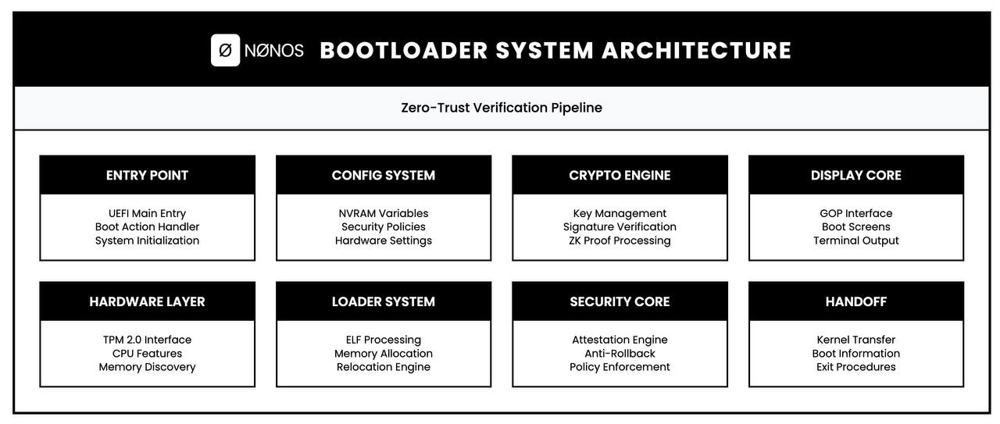
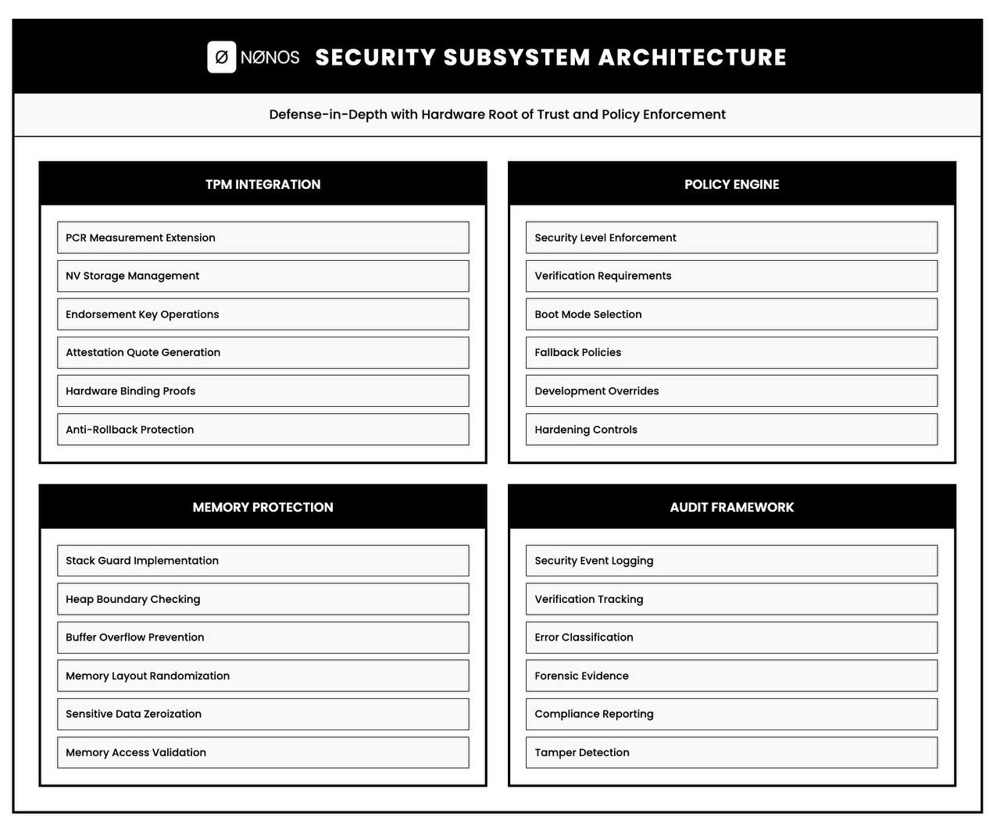
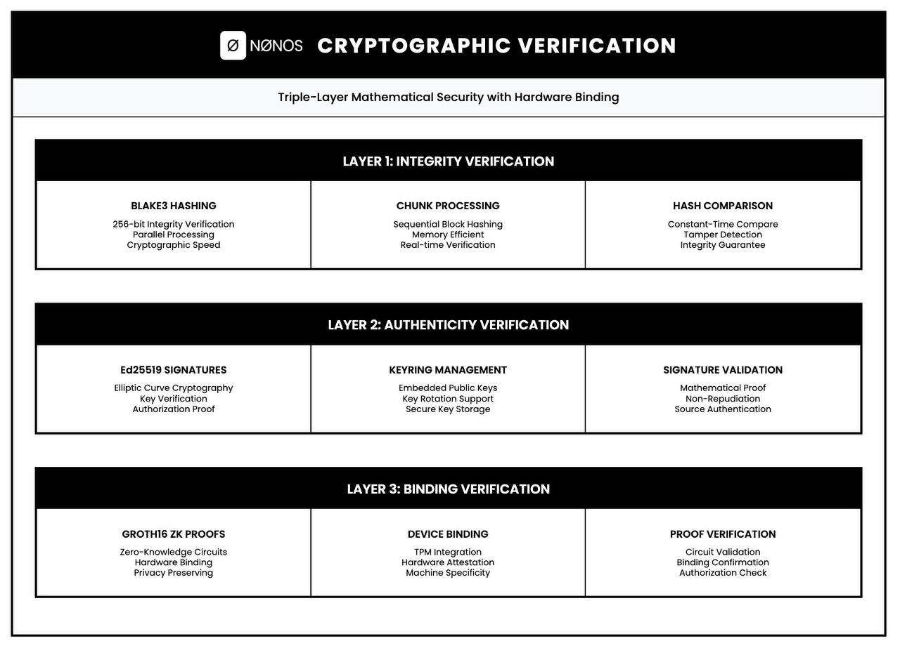

<p align="center">
  
</p>

---

The NØNOS bootloader sits at the very bottom of the trust chain. It runs in UEFI before the operating system exists, before any drivers load, before anything else gets a chance to execute. Its job is simple: verify the kernel is legitimate, then hand over control. If verification fails, the machine halts. No exceptions.

This isn't your typical bootloader that blindly loads whatever binary it finds on disk. Every kernel image must pass a triple-layer cryptographic gauntlet before it runs. We hash the code with BLAKE3, verify an Ed25519 signature against embedded public keys, and validate a Groth16 zero-knowledge proof that binds the kernel to this specific machine. All three must pass. Skip any layer and you get a black screen.

The point is removing trust assumptions. You shouldn't have to trust that your kernel hasn't been tampered with. You shouldn't have to trust that the binary came from the right source. The mathematics proves it for you, every single boot.

---

## System Architecture

<p align="center">
  
</p>

The bootloader breaks down into eight distinct subsystems, each handling a specific piece of the boot puzzle.

**Entry Point** catches control from UEFI firmware, sets up the execution environment and kicks off the boot sequence. Nothing fancy here, just getting the house in order.

**Config System** pulls settings from NVRAM variables. Security policies, hardware preferences, boot options. Falls back to sane defaults if NVRAM is empty or corrupted.

**Hardware Layer** talks to the TPM 2.0 chip when present. Reads CPU feature flags, queries available memory, figures out what we're working with.

**Crypto Engine** handles all the signature verification and proof validation. Ed25519 for signatures, BLAKE3 for hashing, arkworks for the ZK circuits. Everything runs in constant time to avoid side channels.

**Loader System** parses ELF binaries, allocates memory pages, processes relocations. Standard loader stuff, nothing exotic.

**Security Core** enforces whatever policy is configured. Strict mode requires TPM and Secure Boot. Standard mode just needs valid signatures. Development mode is more relaxed for debugging.

**Display Core** renders boot status through UEFI Graphics Output Protocol. Shows progress, errors, verification results.

**Handoff** prepares the boot information structure and transfers control to the kernel entry point. Last thing the bootloader does before it's out of the picture.

---

## Cryptographic Verification

<p align="center">
  
</p>

Three layers of verification, each proving something different.

**Layer 1 — Integrity.** BLAKE3 hashes the entire kernel image. We process it in chunks to keep memory usage reasonable, then compare the result against what's stored in the image footer. Constant-time comparison, obviously. This catches any bit-flip or corruption, accidental or otherwise.

**Layer 2 — Authenticity.** Ed25519 signature verification using the dalek-cryptography library. The bootloader has public keys embedded at compile time. The kernel carries a signature in its footer. We verify the signature covers the kernel code and was made by a key we trust. This proves the kernel came from someone who holds the private signing key.

**Layer 3 — Binding.** Groth16 zero-knowledge proof over BLS12-381, built with arkworks. The proof commits to the kernel hash, a hardware-derived machine identifier, and a boot nonce. Verification confirms this kernel was attested for this specific machine. Replay attacks from other devices fail here.

All three layers must pass. There's no partial credit.

---

## Boot Sequence

<p align="center">
  
</p>

Ten stages from power-on to kernel entry.

**01 — UEFI Entry Point.** Firmware hands control to the bootloader. We save the system table pointer, initialize our runtime and prepare for what comes next.

**02 — Configuration Loading.** Read NVRAM variables for boot preferences. If nothing's there, use compiled-in defaults. Validate whatever we get.

**03 — Hardware Discovery.** Probe for TPM 2.0 and initialize if present. Check CPU features like NX, SMEP, SMAP. Inventory available memory.

**04 — Crypto Subsystem Init.** Load the embedded signing keys into the keyring. Initialize the BLAKE3 and Ed25519 contexts. Prepare the ZK verifier with the ceremony parameters.

**05 — Policy Enforcement.** Apply the configured security policy. Strict mode requires TPM and Secure Boot both active. Standard mode is less demanding. Check what we have against what's required.

**06 — Kernel Location.** Find the kernel binary on the EFI System Partition. Usually at `\EFI\nonos\kernel.bin`. Load it into memory.

**07 — Cryptographic Verification.** Run the triple-layer pipeline. Hash, verify signature, validate ZK proof. Any failure here means we halt.

**08 — ELF Loading.** Parse the kernel ELF headers. Allocate pages with appropriate permissions. Process relocations for position-independent code.

**09 — Final Audit.** Last security checks before handoff. Extend TPM PCRs if available. Log the boot measurements.

**10 — Handoff.** Build the boot information structure with memory map, framebuffer details, ACPI pointers. Jump to the kernel entry point. Bootloader's job is done.

---

## Building

### Prerequisites

Rust nightly toolchain with UEFI target support.

```
rustup install nightly
rustup target add x86_64-unknown-uefi
rustup component add rust-src
```

### Full Build

From the kernel repository root, run:

```
make all
```

This does everything in sequence:

1. Checks the toolchain and installs missing components
2. Generates signing keys if they don't exist
3. Runs the ZK trusted setup if ceremony keys are missing
4. Builds the UEFI bootloader
5. Builds the kernel
6. Signs the kernel with Ed25519
7. Generates and embeds the ZK attestation proof
8. Creates the EFI System Partition

Output looks like this:

```
Building UEFI bootloader...
   Compiling nonos_boot v1.0.5
    Finished `release` profile [optimized] target(s) in 2m 04s

Building kernel...
    Finished `release` profile [optimized] target(s) in 0.83s

Signing kernel with Ed25519...
Kernel: 321163912 bytes
Signature: 64 bytes
Footer: 64 bytes (NONOSIMG)
Public key: 3752c56fc79dc4b3eb6d2ab9a5a358a5b74ef762f15f26f27f62d1d1708c67c1
Output: target/kernel_signed.bin (321164040 bytes)

Generating and embedding ZK attestation proof...
=== NONOS ZK Attestation Prover ===

Signed kernel: 321164040 bytes
Kernel code: 321163912 bytes
Kernel BLAKE3: b63689e4264b32fce4e30bc46493b15ba4dedc841562d8f5b7d070e18793361b
Boot nonce: 2ac1ecedc226222f
Machine ID: d503a44606b130af
Proving key loaded

Program hash: fa02d10e8804169a47233e34a6ff3566248958adff55e1248d50304aff4ab230
Capsule commitment: eb7cbd1f0a9aaaeab1cddc1e5ace86781670dfc41ce730050fc600762f1cba14

Generating Groth16 proof...
Proof generated: 192 bytes
Public inputs: 320 bytes

=== Output ===
Written: target/kernel_attested.bin (321164728 bytes)

Breakdown:
  Kernel:      321163912 bytes
  Signature:   64 bytes
  ZK block:    688 bytes
  Footer:      64 bytes
  Total:       321164728 bytes

Creating EFI System Partition...
ESP ready at target/esp
```

### Build Bootloader Only

```
cd nonos-bootloader
cargo build --release --target x86_64-unknown-uefi
```

Output: `target/x86_64-unknown-uefi/release/nonos_boot.efi`

---

## Running

### QEMU

```
make run
```

Boots the system in QEMU with networking enabled:

```
Booting NONOS in QEMU...
  SSH:  ssh -p 2222 localhost
  HTTP: http://localhost:8080
  Quit: Ctrl+A then X
```

### VirtualBox

```
make run-vbox
```

Creates a VM with ICH9 chipset and Intel e1000 NIC, converts the disk image to VDI format and boots it.

### Debug Mode

```
make debug
```

Starts QEMU with GDB server on port 1234. Connect with:

```
gdb -ex 'target remote :1234'
```

### Real Hardware

Build a bootable ISO:

```
make iso
```

Or a raw disk image for USB:

```
make usb
```

Write it to a USB drive:

```
sudo dd if=target/nonos.img of=/dev/sdX bs=4M status=progress
```

Boot with Secure Boot disabled. The bootloader handles its own verification chain.

---

## Signing Keys

### Key Generation

The build generates a signing key automatically if one doesn't exist:

```
Generating new signing key...
Key saved to nonos-bootloader/keys/signing_key_v1.bin
```

This is a 32-byte Ed25519 seed. Keep it safe. Anyone with this key can sign kernels that your bootloader will accept.

### Manual Key Generation

```
cd nonos-bootloader/tools/keygen
cargo run --release -- generate --output ../../keys/
```

### Key Rotation

To rotate keys:

1. Generate new keypair
2. Rebuild bootloader with new public key embedded
3. Re-sign kernel with new private key
4. Deploy both together

The bootloader only trusts keys compiled into it. There's no runtime key loading.

### Key Fingerprint

The bootloader logs the key fingerprint at boot:

```
[INFO] security: Key fingerprint: 1a19447c54f5fc50
[INFO] security: Key ID: 1a19447c
```

Match this against your expected key to verify the right bootloader is running.

---

## ZK Attestation

### What It Does

The ZK attestation layer binds a kernel to a specific machine. Even if someone steals your signed kernel binary, they can't boot it on a different machine. The proof commits to:

- Kernel BLAKE3 hash
- Hardware-derived machine identifier (TPM endorsement key or CPU ID fallback)
- Random boot nonce

Verification happens at boot time without revealing the machine identifier to the kernel or any observer.

### Trusted Setup

The ZK circuit needs proving and verifying keys from a trusted setup ceremony:

```
cd nonos-bootloader/tools/nonos-attestation-circuit
cargo run --release --bin generate-keys -- \
  generate --output generated_keys/ --seed "nonos-production-attestation-v1-2026"
```

Output:

```
Running trusted setup for ZK circuit...
Proving key: generated_keys/attestation_proving_key.bin
Verifying key: generated_keys/attestation_verifying_key.bin
```

The seed ensures reproducible key generation. Same seed, same keys. Production deployments should use a proper multi-party ceremony.

### Proof Generation

The `embed-zk-proof` tool generates and embeds proofs:

```
cd nonos-bootloader/tools/embed-zk-proof
cargo run --release -- \
  --input target/kernel_signed.bin \
  --output target/kernel_attested.bin \
  --proving-key ../nonos-attestation-circuit/generated_keys/attestation_proving_key.bin \
  --seed "nonos-production-attestation-v1-2026" \
  --verbose
```

Output shows the proof generation:

```
=== NONOS ZK Attestation Prover ===

Signed kernel: 321164040 bytes
Kernel code: 321163912 bytes
Kernel BLAKE3: b63689e4264b32fce4e30bc46493b15ba4dedc841562d8f5b7d070e18793361b
Boot nonce: 2ac1ecedc226222f
Machine ID: d503a44606b130af
Proving key loaded

Program hash: fa02d10e8804169a47233e34a6ff3566248958adff55e1248d50304aff4ab230
Capsule commitment: eb7cbd1f0a9aaaeab1cddc1e5ace86781670dfc41ce730050fc600762f1cba14

Generating Groth16 proof...
Proof generated: 192 bytes
Public inputs: 320 bytes

=== Output ===
Written: target/kernel_attested.bin (321164728 bytes)
```

### Proof Structure

The attestation block appended to the kernel:

| Field | Size | Description |
|-------|------|-------------|
| Magic | 8 bytes | `ZKATTST\0` |
| Version | 2 bytes | Protocol version |
| Proof | 192 bytes | Groth16 proof (compressed) |
| Public inputs | 320 bytes | Circuit public inputs |
| Boot nonce | 8 bytes | Random per-boot value |
| Commitment | 32 bytes | Capsule commitment hash |
| Reserved | 126 bytes | Future use |

Total ZK block: 688 bytes.

### Verification at Boot

The bootloader verifies the proof before loading the kernel:

```
[INFO] zk_bind: comparing commitments
[INFO] zk_dbg: stored: 3b9d95600ecd5945
[INFO] zk_dbg: expect: 3b9d95600ecd5945
[INFO] zk_dbg: kh_act: b63689e4264b32fc
[INFO] zk_dbg: kh_blk: b63689e4264b32fc
[INFO] zk: ZK attestation VERIFIED with kernel binding
```

If verification fails:

```
[ERROR] zk: Proof verification FAILED
[ERROR] zk: Commitment mismatch - possible replay attack
```

Machine halts. No kernel execution.

---

## Kernel Image Format

### NONOSIMG Footer

Every kernel binary ends with a 64-byte footer:

| Offset | Size | Field |
|--------|------|-------|
| 0 | 8 | Magic: `NONOSIMG` |
| 8 | 2 | Version |
| 10 | 2 | Flags |
| 12 | 1 | Hash algorithm (1 = BLAKE3) |
| 13 | 1 | Signature algorithm (1 = Ed25519) |
| 14 | 2 | Reserved |
| 16 | 8 | Total image size |
| 24 | 4 | Reserved |
| 28 | 4 | Kernel code size |
| 32 | 4 | Kernel code offset |
| 36 | 4 | Signature size (64) |
| 40 | 4 | ZK block offset |
| 44 | 4 | ZK block size |
| 48 | 4 | Load address hint |
| 52 | 12 | Reserved |

### Full Image Layout

```
+---------------------------+
|     Kernel ELF binary     |  ~320 MB
+---------------------------+
|    Ed25519 signature      |  64 bytes
+---------------------------+
|     ZK attestation        |  688 bytes
+---------------------------+
|     NONOSIMG footer       |  64 bytes
+---------------------------+
```

---

## Security Policies

### Policy Levels

**Strict** — Full lockdown. Requires:
- TPM 2.0 present and initialized
- UEFI Secure Boot enabled
- Platform Key verified
- All three verification layers pass

**Standard** — Production default. Requires:
- Ed25519 signature valid
- ZK attestation valid
- TPM optional but used if present

**Development** — For debugging. Requires:
- Ed25519 signature valid
- ZK attestation optional
- Allows unsigned modules

### Configuration

Set via NVRAM variables:

```
# Using efibootmgr
efibootmgr -c -d /dev/sda -p 1 -L "NONOS" -l '\EFI\Boot\BOOTX64.EFI'

# Set security level
efivar -n 8be4df61-93ca-11d2-aa0d-00e098032b8c-NONOS_SECURITY_LEVEL -w standard
```

Or through UEFI Shell:

```
Shell> set NONOS_SECURITY_LEVEL standard
Shell> set NONOS_REQUIRE_TPM false
Shell> set NONOS_BOOT_TIMEOUT 5
```

### Available Variables

| Variable | Values | Default |
|----------|--------|---------|
| `NONOS_SECURITY_LEVEL` | `strict`, `standard`, `development` | `standard` |
| `NONOS_REQUIRE_TPM` | `true`, `false` | `false` |
| `NONOS_BOOT_TIMEOUT` | 0-30 (seconds) | `5` |
| `NONOS_VERBOSE` | `true`, `false` | `false` |
| `NONOS_HALT_ON_WARN` | `true`, `false` | `false` |

---

## TPM Integration

### Supported Operations

- PCR measurement extension (PCR 8-15)
- Endorsement key reading for machine ID
- NV storage for rollback counters
- Attestation quote generation

### PCR Allocation

| PCR | Contents |
|-----|----------|
| 8 | Bootloader code hash |
| 9 | Bootloader config hash |
| 10 | Kernel code hash |
| 11 | Kernel signature |
| 12 | ZK proof hash |
| 13 | Boot nonce |
| 14-15 | Reserved |

### Without TPM

If no TPM is present, the bootloader falls back to:
- CPU serial number for machine ID
- No measured boot (PCR extension skipped)
- No hardware-backed rollback protection

Warning logged:

```
[WARN] zk_init: TPM EK unavailable, using fallback machine ID
[WARN] zk_init: TPM not initialized
```

---

## Troubleshooting

### Boot Hangs at Verification

Check serial output. Connect with:

```
make run-serial
```

Common causes:
- Wrong signing key (signature mismatch)
- ZK proof generated for different machine
- Corrupted kernel image

### "Commitment mismatch" Error

The kernel was attested for a different machine. Regenerate the ZK proof on the target machine:

```
make sign-kernel
make embed-zk-proof
```

### TPM Errors

```
[ERROR] security: Cannot read SecureBoot: NOT_FOUND
[ERROR] security: Platform Key missing: NOT_FOUND
```

Normal on QEMU. Real hardware needs Secure Boot configured in BIOS.

### Key Fingerprint Mismatch

If the logged fingerprint doesn't match your expected key, someone replaced the bootloader. Don't boot.

---

## Source Layout

```
nonos-bootloader/
├── src/
│   ├── main.rs              # UEFI entry point
│   ├── lib.rs               # Library root
│   ├── boot/                # Boot sequence orchestration
│   ├── config/              # NVRAM variables and policy config
│   ├── crypto/              # Ed25519, BLAKE3, Groth16 verification
│   ├── display/             # GOP framebuffer and boot screens
│   ├── entropy/             # Hardware RNG and seed collection
│   ├── entry/               # UEFI application entry
│   ├── firmware/            # UEFI protocol wrappers
│   ├── handoff/             # Kernel transfer and boot info
│   ├── hardware/            # TPM, CPU features, memory discovery
│   ├── image_format/        # NONOSIMG parsing
│   ├── kernel_verify/       # Triple-layer verification pipeline
│   ├── loader/              # ELF parsing and relocation
│   ├── log/                 # Serial and display logging
│   ├── menu/                # Boot menu interface
│   └── network.rs           # PXE boot support
├── tools/
│   ├── keygen/              # Ed25519 key generation
│   ├── sign-kernel/         # Kernel signing utility
│   ├── embed-zk-proof/      # ZK proof embedding
│   ├── nonos-attestation-circuit/  # Groth16 circuit definition
│   ├── zk-ceremony/         # Multi-party trusted setup
│   ├── zk-embed/            # Alternative proof embedder
│   └── threshold-sign/      # Threshold signature support
├── keys/                    # Signing keys (gitignored)
├── firmware/                # Device firmware blobs (Intel, AMD, Nvidia, Broadcom...)
├── faq/                     # Common questions answered
└── assets/                  # Documentation images
```

---

## Make Targets

| Target | Description |
|--------|-------------|
| `make all` | Full build |
| `make bootloader` | Build bootloader only |
| `make kernel` | Build kernel only |
| `make sign-kernel` | Sign kernel with Ed25519 |
| `make embed-zk-proof` | Generate and embed ZK proof |
| `make esp` | Create EFI System Partition |
| `make run` | Boot in QEMU |
| `make run-vbox` | Boot in VirtualBox |
| `make debug` | Boot with GDB server |
| `make iso` | Create bootable ISO |
| `make usb` | Create bootable USB image |
| `make clean` | Remove build artifacts |
| `make distclean` | Remove everything including keys |

---

## License

AGPL-3.0. See LICENSE file.

The cryptographic libraries (dalek, arkworks, blake3) have their own licenses. Check Cargo.toml for details.
