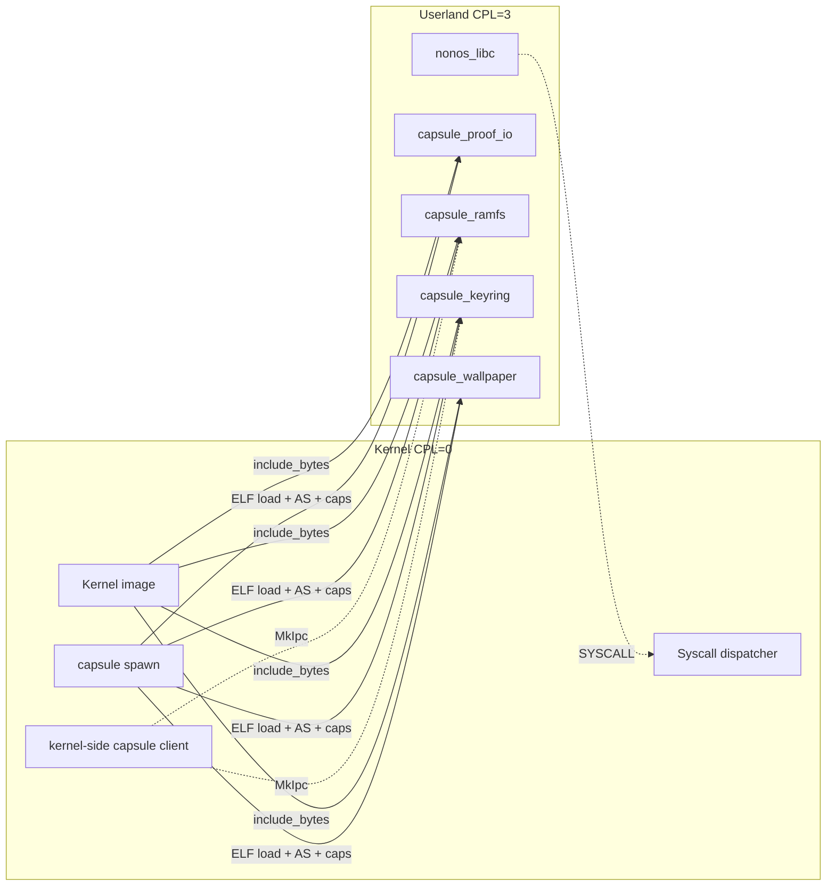
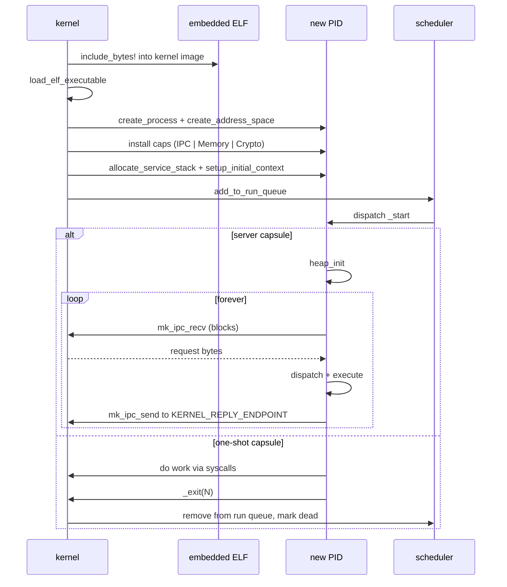
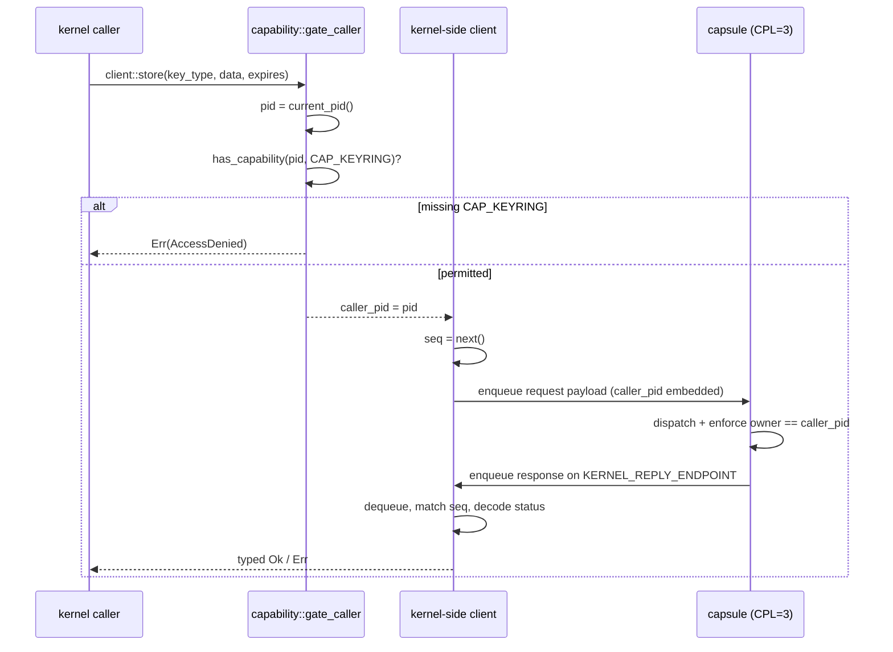

# NONOS Userland

This tree holds every NONOS process that runs at CPL=3. The kernel ships at CPL=0; everything in `userland/` ships as ring-3 ELF binaries that the kernel loads, isolates, and talks to either through return values from a syscall or, for server capsules, through a wire protocol on top of MkIpc.

The split is deliberate. Capsule code never executes in kernel context. Kernel code never executes in capsule context. The contract between them is small, explicit, and lives in source files you can read in one afternoon.

## Boundary



The kernel embeds capsule binaries via `include_bytes!`, loads them with `crate::elf::loader::load_elf_executable`, gives each one a fresh address space, installs a capability mask, and adds the new PID to the run queue. After that the capsule runs as any other userland process.

## Capsule status

| Capsule | Class | Build | Kernel mirror | Spawn site wired | Live consumers | Boot-test proven |
|---|---|---|---|---|---|---|
| capsule_proof_io | one-shot | yes | `crate::userspace::capsule_proof_io` | yes (`init::run_init`) | n/a (one-shot) | yes (boot run prints marker) |
| capsule_ramfs | server | yes | `src/fs/ramfs_capsule/` | yes (`init::run_init`) | yes (capsule fd path) | yes (`tests/boot/ramfs_round_trip.sh`) |
| capsule_keyring | server | yes | `src/security/keyring_capsule/` | yes (`init::run_init`) | none yet | not yet (smoketest + harness pending) |
| capsule_wallpaper | one-shot | yes | not yet | not yet | n/a (one-shot) | not yet |

"Live consumers" means a kernel-side caller that already routes through the capsule client. The keyring capsule is built and wired into the spawn path, but the call sites that previously held in-kernel keyring state have not been re-pointed yet. Until that lands and a boot-test confirms the round trip, the keyring is not runtime-proven.

## Layout

```
userland/
├── x86_64-nonos-user.json     target spec for every binary in this tree
├── libc/                      the only userland runtime; every capsule depends on it
│   ├── Cargo.toml
│   └── src/
│       ├── crypto/            crypto_random, crypto_encrypt, crypto_decrypt
│       ├── graphics/          nonos_display_dimensions, nonos_surface_*
│       ├── heap/              heap_init + global allocator
│       ├── ipc/               mk_ipc_send, mk_ipc_recv, mk_ipc_call
│       ├── mem/               mmap, brk
│       ├── signal/            rt_sigreturn trampoline
│       ├── syscall/           call_raw + numeric constants (kernel is source of truth)
│       ├── unistd/            _exit, read, write
│       ├── lib.rs             the public surface
│       └── panic.rs           _exit(134), the SIGABRT exit-code convention
├── capsule_proof_io/          one-shot, prints a marker, exits
├── capsule_ramfs/             server, owns /ram namespace, infinite recv loop
├── capsule_keyring/           server, owns the per-PID key store
└── capsule_wallpaper/         one-shot, exercises the graphics contract end-to-end
```

There are exactly two crate kinds. `libc` is a static library (`staticlib + rlib`). The four `capsule_*` directories are `bin` crates. Nothing else lives here.

## Toolchain

| Pin | Source of truth |
|---|---|
| `nightly-2026-01-16` | `Makefile` `TOOLCHAIN :=` |
| `x86_64-nonos-user` target | `userland/x86_64-nonos-user.json` |
| `-Zbuild-std=core,alloc` | every Makefile capsule rule |

Every capsule and the libc are built with this exact toolchain. Mixing toolchains within `userland/` is a bug; build artifacts will pick up incompatible `compiler_builtins` revisions.

## Target spec

`userland/x86_64-nonos-user.json` is the userland target. It pins:

- `target-pointer-width: 64`, `arch: x86_64`, `vendor: unknown`, `os: nonos`
- `panic-strategy: abort`
- no red zone (kernel manages signal stacks, no leaf-function stack reuse)
- statically linked, no dynamic linker
- single `_start` entry, no `_main`/CRT shim

The kernel's own target is `x86_64-nonos.json`. The userland target is distinct so that no userland binary ever sees a kernel-only relocation type or feature.

## The libc

`userland/libc/` is the single runtime that every capsule links against. It is `no_std`, exposes a `_start`/`_exit` ABI, owns the panic handler, owns the heap allocator, and owns every syscall wrapper. Capsule code does not call `syscall` instructions directly; it calls a libc wrapper.

### Surface

| Family | Module | Symbols |
|---|---|---|
| Process control | `unistd` | `_exit`, `read`, `write` |
| Memory | `mem` | `mmap`, `brk` |
| Heap | `heap` | `init` (alias `heap_init`), `HeapError` |
| IPC | `ipc` | `mk_ipc_send`, `mk_ipc_recv`, `mk_ipc_call` |
| Crypto | `crypto` | `crypto_random`, `crypto_encrypt`, `crypto_decrypt` |
| Graphics | `graphics` | `nonos_display_dimensions`, `nonos_surface_create/destroy/map/present_full`, `NONOS_PIXEL_FMT_ARGB8888` |
| Signal trampoline | `signal` | `__nonos_rt_sigreturn` |
| Panic | `panic` | `_exit(134)` (private) |

### Allocator

`heap::init()` reserves a 4 MiB region by walking the program break (`brk`), then hands ownership to a `linked_list_allocator`. Allocations beyond 4 MiB are not currently grown; OOM goes through `alloc_error_handler`, which calls the panic handler, which calls `_exit(134)`. A capsule that cannot allocate cannot serve, so abort is the correct response.

`heap_init()` is one-shot. The first successful call locks initialisation; later calls return `HeapError::AlreadyInitialized`. Server capsules must call it before their `run()` loop. One-shot capsules that never allocate do not need to call it.

### Panic

`#[panic_handler]` calls `_exit(134)`. 134 is `128 + 6`, the conventional SIGABRT exit code. The kernel observes it through normal process exit accounting. There is no userland panic message printed, and no double-fault path; the panic handler returns `!`.

### Syscall trampoline

```
rax = number
rdi = a1, rsi = a2, rdx = a3
r10 = a4 (rcx is clobbered by SYSCALL itself)
r8  = a5
r9  = a6
return in rax
clobbers: rcx (return RIP), r11 (return RFLAGS)
```

`raw()` in `libc/src/syscall/raw.rs` is the only place this assembly lives. Every wrapper goes through `call_raw(N_*, [u64; 6])`. There is no second syscall path.

### Syscall numbering blocks

Kernel side is the source of truth (`crate::syscall::numbers::SyscallNumber`). The libc mirrors numbers in `userland/libc/src/syscall/numbers.rs`.

| Range | Family |
|---|---|
| 0..99 | POSIX-shape (read=0, write=1, mmap=9, brk=12, rt_sigreturn=15, exit=60) |
| 900..999 | crypto (random=900, encrypt=904, decrypt=905) |
| 1300..1399 | graphics (display dims=1300, surface create=1301, destroy=1302, map=1303, present_full=1304) |
| 0x1000..0x1FFF | microkernel IPC (send=0x1000, recv=0x1001, call=0x1002) |

When adding a new family, claim a block. Do not interleave new numbers into an existing block.

## Capsule classes

Two patterns coexist. Each has a different kernel-side lifecycle contract.

### Server capsule

`heap_init` first, then an infinite `run()` that drives `mk_ipc_recv` and writes back via `mk_ipc_send`. The kernel side allocates a SERVICE_PORT and a REPLY_PORT, registers the capsule in the service registry, tracks liveness against the process table, and bumps a generation counter on respawn so stale handles fail deterministically.

Examples: `capsule_ramfs`, `capsule_keyring`.

### One-shot capsule

Do work, then `_exit(N)`. No IPC server, no liveness tracking, no generation counter, no restart expectation. The kernel spawns it, waits for the exit code (or just observes it left), and moves on.

Examples: `capsule_proof_io`, `capsule_wallpaper`.

A capsule must be one or the other. Do not write a half-server, half-one-shot. If you need a one-shot that occasionally accepts an IPC, it is a server with a short timeout.

## Process lifecycle



### What the kernel installs at spawn

| Resource | Source |
|---|---|
| ELF image | `crate::elf::loader::load_elf_executable(BIN)` |
| Address space | `crate::memory::paging::manager::create_address_space(pid)` |
| Capability mask | `Capability::IPC.bit() \| Capability::Memory.bit() \| Capability::Crypto.bit()` (default) |
| Stack | `crate::kernel_core::process_spawn::allocate_service_stack(pid)` |
| Initial context | `crate::kernel_core::process_spawn::setup_initial_context(pid, entry, stack_top)` |
| Service endpoint | `crate::services::registry::register_endpoint(SERVICE_NAME, SERVICE_PORT, pid, caps)` (server only) |
| Reply inbox | `crate::ipc::nonos_inbox::register_inbox(REPLY_INBOX)` (server only) |

A capsule may need additional caps; if it does, the spawn function for that capsule grants them explicitly. There is no implicit cap escalation; any cap the capsule does not get at spawn it can never get.

## IPC contract for server capsules

Every server capsule that the kernel calls into uses the same wire shape.

### Header (8 bytes)

```
request:  [u32 seq][u16 op][u16 reserved]
response: [u32 seq][i32 status]
```

All fields little-endian, packed, no alignment padding. `status` is 0 on success, negative errno on failure. `seq` is allocated by the kernel-side client (atomic counter); the capsule echoes it on the response so the client can match replies even when interleaved.

### Per-op payload

The header is followed by the op-specific payload. Layouts are documented per capsule alongside the wire encoders. Example for keyring `STORE`:

```
request:  [u32 caller_pid][u64 now][u64 expires_at][u8 key_type][u16 data_len][data...]
response: [u32 key_id]
```

`caller_pid`, `now`, and `expires_at` are filled in by the kernel-side client from `current_pid()` and `crate::time::timestamp_millis()`. The capsule does not read them from the underlying recv buffer except via this payload, and it never trusts them from any other source.

### Trusted identity

`caller_pid` enters the wire payload only because the kernel-mediated client put it there. There is no path by which a capsule can read identity from anywhere else: the recv buffer is the only source of input, and the kernel client is the only writer to that buffer for the relevant request type. This is the entire reason the capsule can act on per-PID ownership decisions safely.

### Round-trip



### Failure modes

| Failure | Detection | Result |
|---|---|---|
| Capsule not running | `state::is_alive()` returns false at send time | `Err(Dead)` |
| Capsule died mid-call | `state::is_alive()` rechecks each yield | `Err(Dead)` |
| Reply lost / no response within RECV_YIELDS | counter exhaustion | `Err(TransportFailure)` |
| Reply payload malformed | `decode_response` returns None | `Err(ProtocolMismatch)` |
| Reply payload wrong length for op | per-op check after status | `Err(ProtocolMismatch)` |
| Status != 0 | per-op `errno::map(status)` | typed `Err(NotFound | AccessDenied | ...)` |

There is no infinite wait. The transport spins through `crate::sched::yield_now()` for at most `RECV_YIELDS` iterations, then gives up.

### Endpoint and port allocation

Every server capsule needs two ports and one reply inbox name. Current allocation:

| Capsule | SERVICE_PORT | REPLY_PORT | KERNEL_REPLY_ENDPOINT | REPLY_INBOX |
|---|---|---|---|---|
| ramfs | 4096 | 4097 | 0x1_0000_0001 | endpoint.4294967297 |
| keyring | 4098 | 4099 | 0x1_0000_0002 | endpoint.4294967298 |

Rule: claim the next free even SERVICE_PORT, the odd port immediately after as REPLY_PORT, and the next reply endpoint above the 32-bit boundary. The numeric REPLY_INBOX is the decimal of KERNEL_REPLY_ENDPOINT; both kernel-side `spawn_*_capsule()` and userland `KERNEL_REPLY_ENDPOINT` constants must agree.

`docs/production-ledger/05-loader-exec-userspace/capsule-conventions.md` is the canonical allocation table.

## Restart semantics

A server capsule's in-process state is owned by the capsule, not by the kernel. The kernel keeps a generation counter that bumps on every successful spawn. Any kernel-side handle (e.g. a file descriptor that resolves to a capsule call) carries the generation it was opened against; on the next call, the kernel client compares its expected generation to `state::current_generation()`, and if they differ, returns the deterministic stale-handle error for the API surface (e.g. `EIO` for capsule fds).

Respawn means an empty store. There is no persistence on the userland side. Capsule respawn is the boundary at which all in-flight ephemeral state is cleared, by design.

## Capability model

Two distinct capability namespaces coexist in the same per-PID `caps: u64` word and are checked by `crate::services::caps::has_capability(pid, bit)` against `crate::syscall::microkernel::capability::CAP_TABLE`.

| Source | Examples | Purpose |
|---|---|---|
| `crate::capabilities::Capability` | `IPC` (8), `Memory` (16), `Crypto` (32) | what a capsule itself needs to run |
| `crate::services::caps::CAP_*` | `CAP_KEYRING` (1<<16), `CAP_VFS` (1<<0) | what a caller needs to invoke a service |

The bit positions do not overlap; `Capability::Memory` is bit 4 (value 16), `CAP_KEYRING` is bit 16 (value 65536). They share the same word safely.

A capsule itself does not need its own service capability. The keyring capsule does not need `CAP_KEYRING`; it is the keyring. Callers need `CAP_KEYRING`. The kernel-side client checks this at the top of every entry function via `capability::gate_caller()`, which reads `current_pid()` and verifies the cap. There is no other entry point into the keyring on the live path.

## Boot sequence

The capsule spawn points are inside `crate::userspace::init::run_init`, after the kernel-thread services are up and after the ramfs capsule has registered. Order matters; the keyring spawn comes after ramfs so that anything reading configuration off `/ram` is available first.

```
init_core_systems
    boot_log + serial
    memory init
    process table init
    capabilities init for init PCB
    ipc init
    crypto rng + kernel keys
    network stack init

userspace::run_init
    spawn driver services (kthreads)
    spawn kernel services (kworker, softirq)
    spawn crypto engines (entropy, aes, chacha, sha3, blake3)
    spawn signature services (ed25519, secp256k1)
    spawn pq crypto (kyber, dilithium)
    spawn zk services
    spawn system services (netmgr, tls, wallet, storage, udev)
    spawn_ramfs_capsule          (real CPL=3 capsule)
    spawn_keyring_capsule        (real CPL=3 capsule)
    spawn core services (vfs, display, input, network, ...)
    lower init priority
    capsule_proof_io::launch     (one-shot, replaces init image)
    init_loop
```

`spawn_*_capsule` failures are logged and discarded. The kernel does not fall back to an in-kernel replacement; later requests against the dead capsule return `Err(Dead)` deterministically.

## Cargo profile

Every `capsule_*` crate uses the same release profile:

| Setting | Value | Reason |
|---|---|---|
| `panic` | `abort` | no unwind tables in userland; `_exit(134)` is the panic path |
| `opt-level` | `2` | favour code size and predictable codegen over `3`'s aggressive vectorisation |
| `lto` | `false` | LTO across `compiler_builtins` + `linked_list_allocator` is brittle on `-Zbuild-std`; off until proven necessary |
| `debug` | `false` | release artifacts ship stripped |
| `strip` | `true` | symbol table not needed; the kernel embeds the binary as bytes |

Dev profile mirrors release except `opt-level = 0` and `debug = true`.

## Feature gates

The kernel toggles capsule embed sites via Cargo features in the kernel `Cargo.toml`:

| Feature | Embeds | Spawns |
|---|---|---|
| `nonos-capsule-proof-io` | `capsule_proof_io` | one-shot via `capsule_proof_io::launch()` |
| `nonos-capsule-ramfs` | `capsule_ramfs` | server via `spawn_ramfs_capsule` |
| `nonos-capsule-keyring` | `capsule_keyring` | server via `spawn_keyring_capsule` |
| `nonos-ramfs-smoketest` | adds `crate::fs::ramfs_capsule::smoketest::run()` after spawn | n/a |

When a feature is off, the kernel-side `embed.rs` resolves the binary slice to `&[]`, and `spawn_*_capsule()` returns `Err(FeatureDisabled)` immediately. The kernel still builds.

## Build

The Makefile owns every userland build target. Do not invoke `cargo` against a capsule directly outside of the Makefile; the toolchain pin, target spec, and `-Zbuild-std` flags are coordinated there.

```
make userland-libc        builds the static libc archive
make proof_io             builds capsule_proof_io
make ramfs_capsule        builds capsule_ramfs
make keyring_capsule      builds capsule_keyring
```

`capsule_wallpaper` does not yet have a Makefile target; it is built directly from its directory while the graphics lane settles on a target name.

The kernel embeds capsule binaries via `include_bytes!`. The kernel build will fail if a capsule feature is on but the capsule binary is not present at the expected path. Build the capsule first, then the kernel:

```
make ramfs_capsule kernel-with-ramfs
make keyring_capsule kernel-with-keyring
```

`kernel-with-keyring` turns on `nonos-capsule-proof-io,nonos-capsule-ramfs,nonos-capsule-keyring` together; it always carries the lower-level capsules so the spawn order in `entry.rs` has its dependencies satisfied.

## Adding a new capsule

1. Pick the class. Server or one-shot. If you cannot answer in one sentence, do not ship it.
2. Create `userland/capsule_<name>/` with the same `Cargo.toml` shape as an existing capsule of the same class. Use `package = "nonos_userland_libc"` for the libc dep.
3. Write `src/main.rs` with `#![no_std] #![no_main]`, `#[no_mangle] pub unsafe extern "C" fn _start() -> !`, and either a `heap_init` + `run()` loop (server) or linear work + `_exit(N)` (one-shot).
4. If server: pick the next free SERVICE_PORT/REPLY_PORT pair and the next KERNEL_REPLY_ENDPOINT from the allocation table above. Update both the userland constant and the kernel-side spawner. Update `capsule-conventions.md`.
5. Add a Makefile target after the existing capsule targets. Pattern matches `ramfs_capsule`. Update `.PHONY`.
6. Add a Cargo feature `nonos-capsule-<name>` in the kernel's `Cargo.toml`.
7. Add a kernel-side mirror under the appropriate domain (`src/<domain>/<name>_capsule/`) with `embed.rs`, `error.rs`, `state.rs` (server only), `spawn.rs`, `protocol/` and `client/` (server only).
8. Wire `spawn_<name>_capsule()` into `src/userspace/init/entry.rs`.
9. Add a `kernel-with-<name>` Makefile rule that turns on the new feature alongside its dependencies.

## File-size discipline

Every file in this tree targets ~75 lines and one responsibility. `mod.rs` is declarations and re-exports only; logic lives in sibling files and is named by purpose (`store/state.rs`, not `store/util.rs`). When a file grows past one concept, split it before adding more.

## What this tree is not

It is not a place for shared utility crates. The libc is the only crate every capsule depends on. If two capsules want to share code, the right answer is to grow the libc surface, not to introduce a sibling utility crate.

It is not a place for long-running daemons that own kernel state. State that must survive a respawn lives kernel-side. Capsules are stateless across restarts by design; the kernel-side mirror is what tracks liveness and generation.

It is not a place for build configuration. The Makefile owns build orchestration. Per-capsule `.cargo/config.toml` files do not belong here.

It is not a place for syscall numbering decisions. Numbers come from `crate::syscall::numbers::SyscallNumber` on the kernel side. The libc constants in `libc/src/syscall/numbers.rs` are a mirror, not a source.

It is not a place for capability bit assignments. Cap bits come from `crate::capabilities::types::Capability` and `crate::services::caps::CAP_*` on the kernel side. The userland never assigns its own.

## Glossary

| Term | Meaning |
|---|---|
| Capsule | a single userland binary that owns one well-defined responsibility |
| Server capsule | infinite recv loop, owns persistent in-process state across requests, one PID for the lifetime of the boot |
| One-shot capsule | linear work then exit, no IPC server, no restart expectation |
| KERNEL_REPLY_ENDPOINT | numeric ID of the inbox the capsule sends responses to; lives above the 32-bit boundary by convention |
| REPLY_INBOX | string form of the above (`endpoint.<decimal>`), used by `nonos_inbox` lookups |
| Generation | monotonic counter in `state.rs` that bumps each time the capsule respawns; kernel handles compare against it to detect stale-after-respawn |
| Kernel-side mirror | the `src/<domain>/<name>_capsule/` tree that owns the spawn point, the IPC client, and the typed error surface for one userland capsule |
| `caller_pid` | the PID of the kernel-side caller, embedded into the request payload by the trusted client; the capsule never reads identity from any other source |
